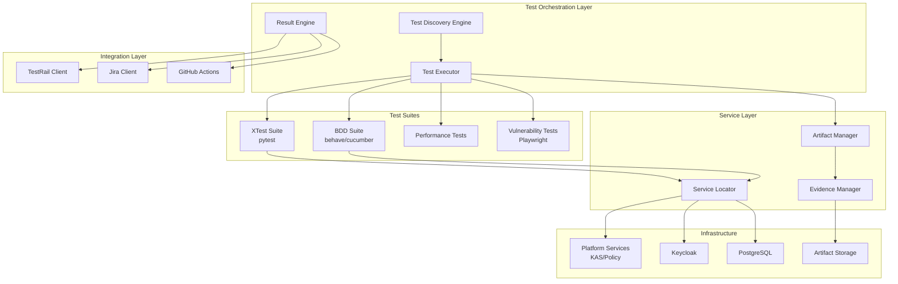

# Test Framework Modernization - Phase 1 Design

## Executive Summary

This document provides the technical design for implementing Phase 1 of the OpenTDF Test Framework Modernization. It details the architecture, components, and implementation approach for achieving the requirements outlined in [REQUIREMENTS.md](./REQUIREMENTS.md).

## 1. Architecture Overview

### 1.1 High-Level Architecture



### 1.2 Component Interactions

The test framework operates in distinct phases:

1. **Discovery Phase**: Identifies tests to run based on tags, profiles, and impact analysis
2. **Execution Phase**: Runs tests with controlled parallelization and deterministic behavior
3. **Collection Phase**: Gathers artifacts, evidence, and results
4. **Publishing Phase**: Sends results to external systems (TestRail, Jira)
5. **Reporting Phase**: Generates coverage matrices and dashboards

## 2. Directory Structure

The test framework uses a modular directory structure with all framework components organized under `/tests/framework/`. To view the complete directory structure, run `tree -L 3` from the tests directory.

Key directories:
- **framework/** - Core framework components including discovery, execution, evidence collection, integrations, schemas, linters, and utilities
- **profiles/** - Test profiles with capability definitions, configurations, and policies
- **xtest/** - Existing cross-SDK compatibility tests
- **bdd/** - Behavior-driven development test suite
- **tools/** - Utility scripts and LLM prompt templates
- **artifacts/** - Test execution artifacts organized by run_id/req.id/profile.id/variant

## 3. Core Components Design

### 3.1 Test Discovery Engine

```python
# framework/core/discovery.py

class TestDiscoveryEngine:
    """Discovers tests based on tags, profiles, and impact analysis."""
    
    def __init__(self, profile_manager: ProfileManager):
        self.profile_manager = profile_manager
        self.tag_parser = TagParser()
        
    def discover_tests(self, 
                       profile_id: str,
                       impact_analysis: Optional[ImpactAnalysis] = None,
                       tags: Optional[List[str]] = None) -> List[TestCase]:
        """
        Discover tests matching criteria:
        1. Load profile configuration
        2. Parse test tags from source files
        3. Apply impact analysis if provided
        4. Filter by risk level and smoke tests
        5. Generate test matrix from capabilities
        """
        profile = self.profile_manager.load_profile(profile_id)
        all_tests = self._scan_test_files()
        
        # Filter by required tags
        filtered = self._filter_by_tags(all_tests, profile.required_tags)
        
        # Apply impact analysis
        if impact_analysis:
            filtered = self._apply_impact_filter(filtered, impact_analysis)
            
        # Generate variants from capability matrix
        test_matrix = self._generate_test_matrix(filtered, profile.capabilities)
        
        return test_matrix
```

### 3.2 Service Locator

```python
# framework/core/service_locator.py

class ServiceLocator:
    """Resolves service endpoints and credentials at runtime."""
    
    def __init__(self, env: str = "local"):
        self.env = env
        self.registry = self._load_service_registry()
        self.secret_manager = SecretManager()
        
    def resolve(self, service_name: str, role: str = "default") -> ServiceConfig:
        """
        Resolve service configuration:
        1. Look up service in registry
        2. Apply environment-specific overrides
        3. Resolve credentials from secret store
        4. Return configured service endpoint
        """
        service = self.registry.get(service_name)
        if not service:
            raise ServiceNotFoundError(f"Service {service_name} not registered")
            
        config = service.get_config(self.env)
        config.credentials = self.secret_manager.get_credentials(
            f"{service_name}_{role}"
        )
        
        return config
        
    def register_service(self, name: str, config: ServiceConfig):
        """Register a new service for discovery."""
        self.registry[name] = config
```

### 3.3 Evidence Manager

```python
# framework/core/evidence.py

class EvidenceManager:
    """Manages evidence collection and artifact generation."""
    
    def __init__(self, artifact_manager: ArtifactManager):
        self.artifact_manager = artifact_manager
        self.schema_validator = JSONSchemaValidator("schemas/evidence.schema.json")
        
    def collect_evidence(self, 
                        test_result: TestResult,
                        profile_id: str,
                        variant: str) -> Evidence:
        """
        Collect evidence for test execution:
        1. Capture test metadata
        2. Collect logs from all sources
        3. Take screenshots if applicable
        4. Gather additional attachments
        5. Generate evidence JSON
        6. Store artifacts
        """
        evidence = Evidence(
            req_id=test_result.requirement_id,
            profile_id=profile_id,
            variant=variant,
            commit_sha=self._get_commit_sha(),
            start_timestamp=test_result.start_time,
            end_timestamp=test_result.end_time,
            status=test_result.status
        )
        
        # Collect artifacts
        evidence.logs = self._collect_logs(test_result)
        evidence.screenshots = self._capture_screenshots(test_result)
        evidence.attachments = self._gather_attachments(test_result)
        
        # Validate against schema
        self.schema_validator.validate(evidence.to_dict())
        
        # Store artifacts
        artifact_path = self.artifact_manager.store(evidence)
        evidence.artifact_url = artifact_path
        
        return evidence
```

### 3.4 TestRail Integration

```python
# framework/integrations/testrail.py

class TestRailClient:
    """TestRail API client for test management integration."""
    
    def __init__(self, config: TestRailConfig):
        self.base_url = config.base_url
        self.auth = (config.username, config.api_key)
        self.project_id = config.project_id
        
    def create_test_run(self, 
                       name: str,
                       test_cases: List[str],
                       description: str = "") -> TestRun:
        """Create a new test run with selected cases."""
        payload = {
            "name": name,
            "description": description,
            "include_all": False,
            "case_ids": [self._parse_case_id(tc) for tc in test_cases],
            "refs": self._get_commit_ref()
        }
        
        response = self._post(f"add_run/{self.project_id}", payload)
        return TestRun.from_dict(response)
        
    def add_result(self,
                   run_id: str,
                   case_id: str,
                   result: TestResult,
                   evidence: Evidence) -> None:
        """Add test result to TestRail run."""
        payload = {
            "status_id": self._map_status(result.status),
            "comment": result.message,
            "elapsed": f"{result.duration}s",
            "custom_artifact_url": evidence.artifact_url,
            "custom_commit_sha": evidence.commit_sha,
            "version": self._get_version()
        }
        
        self._post(f"add_result_for_case/{run_id}/{case_id}", payload)
```

### 3.5 Profile Management

```python
# framework/core/profiles.py

@dataclass
class Profile:
    """Test profile configuration."""
    id: str
    capabilities: Dict[str, List[str]]
    config: ProfileConfig
    policies: ProfilePolicies
    
class ProfileManager:
    """Manages test profiles and capability matrices."""
    
    def __init__(self, profiles_dir: Path = Path("profiles")):
        self.profiles_dir = profiles_dir
        self.capability_catalog = self._load_capability_catalog()
        
    def load_profile(self, profile_id: str) -> Profile:
        """Load profile configuration from disk."""
        profile_path = self.profiles_dir / profile_id
        
        capabilities = self._load_yaml(profile_path / "capabilities.yaml")
        config = self._load_yaml(profile_path / "config.yaml")
        policies = self._load_yaml(profile_path / "policies.yaml")
        
        # Validate capabilities against catalog
        self._validate_capabilities(capabilities)
        
        return Profile(
            id=profile_id,
            capabilities=capabilities,
            config=ProfileConfig.from_dict(config),
            policies=ProfilePolicies.from_dict(policies)
        )
        
    def generate_capability_matrix(self, 
                                  capabilities: Dict[str, List[str]]) -> List[Dict]:
        """Generate test matrix from capability combinations."""
        if not capabilities:
            return [{}]
            
        # Generate pairwise combinations for efficiency
        from itertools import combinations
        
        matrix = []
        for combo in self._generate_pairwise(capabilities):
            matrix.append(combo)
            
        return matrix
```

## 4. Test Suite Integration

### 4.1 XTest (pytest) Integration

```python
# xtest/conftest.py

import pytest
from framework.core import ServiceLocator, EvidenceManager, TestDiscoveryEngine

@pytest.fixture(scope="session")
def service_locator():
    """Provide service locator for test resolution."""
    return ServiceLocator(env=os.getenv("TEST_ENV", "local"))

@pytest.fixture(scope="function")
def evidence_collector(request):
    """Collect evidence for each test."""
    manager = EvidenceManager()
    yield manager
    
    # Collect evidence after test
    if hasattr(request.node, "test_result"):
        evidence = manager.collect_evidence(
            request.node.test_result,
            request.config.getoption("--profile"),
            request.node.variant
        )
        request.node.evidence = evidence

def pytest_configure(config):
    """Configure pytest with framework extensions."""
    # Add custom markers
    config.addinivalue_line(
        "markers", "req(id): mark test with requirement ID"
    )
    config.addinivalue_line(
        "markers", "cap(key=value): mark test with capability"
    )
    
def pytest_collection_modifyitems(config, items):
    """Filter tests based on profile and tags."""
    profile_id = config.getoption("--profile")
    if not profile_id:
        return
        
    discovery = TestDiscoveryEngine()
    selected_tests = discovery.discover_tests(profile_id)
    
    # Filter items based on discovery
    items[:] = [item for item in items if item.nodeid in selected_tests]
```

### 4.2 BDD Integration

```python
# bdd/environment.py

from behave import fixture, use_fixture
from framework.core import ServiceLocator, EvidenceManager

@fixture
def service_locator(context):
    """Setup service locator for BDD tests."""
    context.service_locator = ServiceLocator()
    yield context.service_locator

@fixture  
def evidence_collector(context):
    """Setup evidence collection for scenarios."""
    context.evidence_manager = EvidenceManager()
    yield context.evidence_manager
    
def before_all(context):
    """Global test setup."""
    use_fixture(service_locator, context)
    use_fixture(evidence_collector, context)
    
def before_scenario(context, scenario):
    """Scenario setup with profile binding."""
    # Extract tags
    context.req_id = extract_tag(scenario.tags, "@req:")
    context.capabilities = extract_tags(scenario.tags, "@cap:")
    
    # Setup variant from examples
    if hasattr(context, "active_outline"):
        context.variant = generate_variant_id(context.active_outline)
        
def after_scenario(context, scenario):
    """Collect evidence after scenario execution."""
    evidence = context.evidence_manager.collect_evidence(
        test_result=scenario_to_result(scenario),
        profile_id=context.config.profile_id,
        variant=getattr(context, "variant", "default")
    )
    
    # Attach evidence to scenario for reporting
    scenario.evidence = evidence
```

## 5. Parallelization Strategy

### 5.1 Test Partitioning

```python
class TestPartitioner:
    """Partition tests for parallel execution."""
    
    def partition(self, 
                 tests: List[TestCase],
                 workers: int,
                 strategy: str = "duration") -> List[List[TestCase]]:
        """
        Partition tests across workers:
        - duration: Balance by historical execution time
        - count: Even distribution by test count
        - resource: Group by resource requirements
        """
        if strategy == "duration":
            return self._partition_by_duration(tests, workers)
        elif strategy == "count":
            return self._partition_by_count(tests, workers)
        elif strategy == "resource":
            return self._partition_by_resource(tests, workers)
            
    def _partition_by_duration(self, tests, workers):
        """Balance partitions by estimated duration."""
        # Sort by historical duration (longest first)
        sorted_tests = sorted(tests, key=lambda t: t.avg_duration, reverse=True)
        
        # Greedy bin packing
        partitions = [[] for _ in range(workers)]
        partition_times = [0] * workers
        
        for test in sorted_tests:
            # Add to partition with minimum total time
            min_idx = partition_times.index(min(partition_times))
            partitions[min_idx].append(test)
            partition_times[min_idx] += test.avg_duration
            
        return partitions
```

### 5.2 Execution Orchestration

```yaml
# .github/workflows/test-execution.yml

name: Test Execution Pipeline

on:
  pull_request:
    types: [opened, synchronize]

jobs:
  discover:
    runs-on: ubuntu-latest
    outputs:
      matrix: ${{ steps.discover.outputs.matrix }}
    steps:
      - uses: actions/checkout@v4
      - id: discover
        run: |
          python -m framework.tools.discover \
            --profile=${{ github.event.inputs.profile || 'cross-sdk-basic' }} \
            --output=matrix.json
          echo "matrix=$(cat matrix.json)" >> $GITHUB_OUTPUT
          
  xtest:
    needs: discover
    runs-on: ubuntu-latest
    strategy:
      matrix: ${{ fromJson(needs.discover.outputs.matrix) }}
      max-parallel: 4
    steps:
      - uses: actions/checkout@v4
      - name: Run XTest Suite
        run: |
          python -m pytest xtest/ \
            --profile=${{ matrix.profile }} \
            --variant=${{ matrix.variant }} \
            --junit-xml=results/xtest-${{ matrix.variant }}.xml
        timeout-minutes: 10
        
      - name: Collect Artifacts
        if: always()
        uses: actions/upload-artifact@v3
        with:
          name: xtest-artifacts-${{ matrix.variant }}
          path: artifacts/
          retention-days: 14
          
  bdd:
    needs: discover
    runs-on: ubuntu-latest
    strategy:
      matrix: ${{ fromJson(needs.discover.outputs.matrix) }}
      max-parallel: 2
    steps:
      - uses: actions/checkout@v4
      - name: Run BDD Suite
        run: |
          behave bdd/features \
            --tags=@profile:${{ matrix.profile }} \
            --junit --junit-directory=results/
        timeout-minutes: 15
        
  publish-results:
    needs: [xtest, bdd]
    if: always()
    runs-on: ubuntu-latest
    steps:
      - name: Download all artifacts
        uses: actions/download-artifact@v3
        
      - name: Publish to TestRail
        run: |
          python -m framework.integrations.testrail publish \
            --run-name="PR-${{ github.event.pull_request.number }}" \
            --results=results/
            
      - name: Update Jira
        if: ${{ github.event.inputs.jira_enabled == 'true' }}
        run: |
          python -m framework.integrations.jira update \
            --results=results/ \
            --create-bugs=${{ contains(github.event.pull_request.labels.*.name, 'auto-bug') }}
```

## 6. Determinism Implementation

### 6.1 Time Control

```python
# framework/utils/timing.py

class TimeController:
    """Control time for deterministic testing."""
    
    def __init__(self, base_time: datetime = None):
        self.base_time = base_time or datetime(2024, 1, 1, 0, 0, 0)
        self.offset = timedelta()
        self._patchers = []
        
    def start(self):
        """Start time control with monkey patching."""
        import time
        import datetime as dt
        
        # Patch time.time()
        self._patchers.append(
            mock.patch('time.time', side_effect=self._controlled_time)
        )
        
        # Patch datetime.now()
        self._patchers.append(
            mock.patch('datetime.datetime.now', side_effect=self._controlled_now)
        )
        
        for patcher in self._patchers:
            patcher.start()
            
    def advance(self, seconds: float):
        """Advance controlled time."""
        self.offset += timedelta(seconds=seconds)
        
    def _controlled_time(self):
        """Return controlled Unix timestamp."""
        current = self.base_time + self.offset
        return current.timestamp()
        
    def _controlled_now(self, tz=None):
        """Return controlled datetime."""
        current = self.base_time + self.offset
        if tz:
            current = current.replace(tzinfo=tz)
        return current
```

### 6.2 Randomness Control

```python
# framework/utils/seeding.py

class RandomnessController:
    """Control randomness for deterministic testing."""
    
    def __init__(self, seed: int = 42):
        self.seed = seed
        self.generators = {}
        
    def start(self):
        """Initialize all random number generators."""
        import random
        import numpy as np
        
        # Python random
        random.seed(self.seed)
        
        # NumPy random
        np.random.seed(self.seed)
        
        # Store generators for specific uses
        self.generators['default'] = random.Random(self.seed)
        self.generators['crypto'] = self._create_deterministic_crypto()
        
    def get_generator(self, name: str = 'default'):
        """Get a named random generator."""
        if name not in self.generators:
            self.generators[name] = random.Random(self.seed + hash(name))
        return self.generators[name]
        
    def _create_deterministic_crypto(self):
        """Create deterministic crypto-like randomness for testing."""
        # Use a seeded ChaCha20 cipher for deterministic "secure" random
        from Crypto.Cipher import ChaCha20
        key = hashlib.sha256(str(self.seed).encode()).digest()
        nonce = b'\x00' * 8
        cipher = ChaCha20.new(key=key, nonce=nonce)
        
        class DeterministicCrypto:
            def randbytes(self, n):
                return cipher.encrypt(b'\x00' * n)
                
        return DeterministicCrypto()
```

## 7. Linting and Validation

### 7.1 Tag Linter

```python
# linters/tag_linter.py

class TagLinter:
    """Validate test tags against requirements."""
    
    REQUIRED_TAG_PATTERNS = [
        r'@req:BR-\d{3}',  # Business requirement ID
        r'@cap:\w+=\w+',   # Capability declaration
    ]
    
    OPTIONAL_TAG_PATTERNS = [
        r'@risk:(high|medium|low)',
        r'@smoke',
        r'@testrail:C\d+',
        r'@jira:[A-Z]+-\d+',
    ]
    
    FORBIDDEN_TAG_PATTERNS = [
        r'@profile:',  # Profile tags are forbidden
    ]
    
    def lint_file(self, filepath: Path) -> List[LintError]:
        """Lint a test file for tag compliance."""
        errors = []
        
        with open(filepath) as f:
            content = f.read()
            
        # Extract all tags
        tags = self._extract_tags(content)
        
        # Check required tags
        for pattern in self.REQUIRED_TAG_PATTERNS:
            if not any(re.match(pattern, tag) for tag in tags):
                errors.append(LintError(
                    filepath=filepath,
                    message=f"Missing required tag pattern: {pattern}"
                ))
                
        # Check forbidden tags
        for pattern in self.FORBIDDEN_TAG_PATTERNS:
            matching = [t for t in tags if re.match(pattern, t)]
            if matching:
                errors.append(LintError(
                    filepath=filepath,
                    message=f"Forbidden tag found: {matching[0]}"
                ))
                
        return errors
```

### 7.2 Artifact Linter

```python
# linters/artifact_linter.py

class ArtifactLinter:
    """Validate artifact generation compliance."""
    
    def __init__(self):
        self.schema_validator = JSONSchemaValidator("schemas/evidence.schema.json")
        
    def lint_test_run(self, run_id: str) -> List[LintError]:
        """Validate all artifacts from a test run."""
        errors = []
        artifacts_path = Path(f"artifacts/{run_id}")
        
        # Check evidence.json files
        for evidence_file in artifacts_path.glob("**/evidence.json"):
            try:
                with open(evidence_file) as f:
                    evidence = json.load(f)
                    
                # Validate schema
                self.schema_validator.validate(evidence)
                
                # Check file paths exist
                for log_path in evidence.get("logs", []):
                    if not Path(log_path).exists():
                        errors.append(LintError(
                            filepath=evidence_file,
                            message=f"Referenced log file not found: {log_path}"
                        ))
                        
            except Exception as e:
                errors.append(LintError(
                    filepath=evidence_file,
                    message=f"Invalid evidence JSON: {str(e)}"
                ))
                
        return errors
```

## 8. Coverage Reporting

### 8.1 Coverage Matrix Generator

```python
# framework/reporting/coverage.py

class CoverageMatrixGenerator:
    """Generate feature coverage matrix from test results."""
    
    def generate(self, 
                start_date: datetime,
                end_date: datetime,
                output_format: str = "json") -> Union[dict, str]:
        """Generate coverage matrix for date range."""
        
        # Collect all test runs in date range
        runs = self._collect_runs(start_date, end_date)
        
        # Build coverage data
        coverage = {
            "generated_at": datetime.now().isoformat(),
            "date_range": {
                "start": start_date.isoformat(),
                "end": end_date.isoformat()
            },
            "profiles": [],
            "requirements": []
        }
        
        # Aggregate by BR ID
        br_coverage = defaultdict(lambda: {
            "profiles_covered": set(),
            "capabilities_tested": set(),
            "total_runs": 0,
            "pass_rate": 0.0
        })
        
        for run in runs:
            for result in run.results:
                br_id = result.requirement_id
                br_coverage[br_id]["profiles_covered"].add(result.profile_id)
                br_coverage[br_id]["capabilities_tested"].update(result.capabilities)
                br_coverage[br_id]["total_runs"] += 1
                if result.status == "passed":
                    br_coverage[br_id]["pass_rate"] += 1
                    
        # Calculate pass rates
        for br_id, data in br_coverage.items():
            if data["total_runs"] > 0:
                data["pass_rate"] = data["pass_rate"] / data["total_runs"]
                
            coverage["requirements"].append({
                "req_id": br_id,
                "profiles_covered": list(data["profiles_covered"]),
                "capabilities_tested": list(data["capabilities_tested"]),
                "total_runs": data["total_runs"],
                "pass_rate": data["pass_rate"]
            })
            
        # Add unique profiles
        coverage["profiles"] = list(set(
            p for r in coverage["requirements"] 
            for p in r["profiles_covered"]
        ))
        
        # Format output
        if output_format == "json":
            return coverage
        elif output_format == "html":
            return self._render_html(coverage)
        elif output_format == "markdown":
            return self._render_markdown(coverage)
```

## 9. Implementation Plan

### Phase 1A: Foundation (Weeks 1-3)
1. Implement core framework components
2. Set up profile system and capability catalog
3. Create Service Locator and time/randomness controllers
4. Establish artifact storage structure

### Phase 1B: Integration (Weeks 4-6)
5. Integrate with existing xtest suite
6. Add BDD support with behave
7. Implement TestRail client
8. Add optional Jira integration

### Phase 1C: Validation (Weeks 7-9)
9. Create linters and validators
10. Implement evidence collection
11. Build coverage matrix generator
12. Set up CI/CD pipeline

### Phase 1D: Stabilization (Weeks 10-12)
13. Performance optimization for <10min execution
14. Flake detection and elimination
15. Documentation and training
16. Acceptance testing and rollout

## 10. Migration Strategy

### 10.1 XTest Migration

```python
# migration/migrate_xtest.py

class XTestMigrator:
    """Migrate existing xtest suite to new framework."""
    
    def migrate_test_file(self, filepath: Path):
        """Add required tags to existing test file."""
        
        # Parse existing test
        tree = ast.parse(filepath.read_text())
        
        # Find test functions
        for node in ast.walk(tree):
            if isinstance(node, ast.FunctionDef) and node.name.startswith("test_"):
                # Extract test purpose from docstring or name
                br_id = self._infer_br_id(node)
                capabilities = self._infer_capabilities(node)
                
                # Add decorator with tags
                decorator = ast.parse(
                    f'@pytest.mark.req("{br_id}")\n'
                    f'@pytest.mark.cap({capabilities})'
                ).body[0].decorator_list
                
                node.decorator_list.extend(decorator)
                
        # Write migrated file
        filepath.write_text(ast.unparse(tree))
```

### 10.2 Profile Creation

```yaml
# profiles/cross-sdk-basic/capabilities.yaml

capabilities:
  sdk:
    - go
    - java
    - js
    - swift
  format:
    - nano
    - ztdf
  encryption:
    - aes256gcm
  policy:
    - abac-basic
    
# profiles/cross-sdk-basic/config.yaml

config:
  roles:
    alice: 
      attributes: ["group:engineering", "clearance:secret"]
    bob:
      attributes: ["group:marketing", "clearance:public"]
  selection:
    strategy: "pairwise"  # or "exhaustive"
    max_variants: 50
  timeouts:
    test: 60
    suite: 600
    
# profiles/cross-sdk-basic/policies.yaml

policies:
  waivers:
    - test: "test_legacy_format"
      reason: "Legacy format deprecated"
  expected_skips:
    - condition: "sdk == 'swift' and format == 'ztdf-ecwrap'"
      reason: "Swift SDK doesn't support EC yet"
  severities:
    encryption_failure: "critical"
    policy_mismatch: "high"
    performance_degradation: "medium"
```

## 11. Monitoring and Observability

### 11.1 Metrics Collection

```python
# framework/monitoring/metrics.py

class MetricsCollector:
    """Collect and export test execution metrics."""
    
    def __init__(self, backend: str = "prometheus"):
        self.backend = backend
        self._init_metrics()
        
    def _init_metrics(self):
        """Initialize metric collectors."""
        self.metrics = {
            'test_duration': Histogram(
                'test_duration_seconds',
                'Test execution duration',
                ['test_name', 'profile', 'variant', 'status']
            ),
            'test_count': Counter(
                'test_executions_total',
                'Total test executions',
                ['profile', 'status']
            ),
            'flake_rate': Gauge(
                'test_flake_rate',
                'Test flake rate percentage',
                ['test_name']
            ),
            'artifact_size': Histogram(
                'artifact_size_bytes',
                'Size of test artifacts',
                ['artifact_type']
            )
        }
```

### 11.2 Distributed Tracing

```python
# framework/monitoring/tracing.py

class TestTracer:
    """Distributed tracing for test execution."""
    
    def __init__(self):
        self.tracer = self._init_tracer()
        
    @contextmanager
    def trace_test(self, test_name: str, attributes: dict):
        """Create trace span for test execution."""
        with self.tracer.start_as_current_span(
            f"test.{test_name}",
            attributes=attributes
        ) as span:
            try:
                yield span
            except Exception as e:
                span.set_status(Status(StatusCode.ERROR, str(e)))
                raise
            finally:
                span.set_attribute("test.duration", span.end - span.start)
```

## 12. Security Considerations

### 12.1 Secret Management

- All secrets stored in environment variables or secret management service
- No credentials in code, configuration files, or artifacts
- Service accounts with minimal required permissions
- Automatic secret rotation support

### 12.2 Artifact Security

- Sanitize all test data before storage
- Encrypt sensitive artifacts at rest
- Access control for artifact retrieval
- Audit logging for all artifact access

### 12.3 Network Security

- TLS for all external communications
- Certificate pinning for critical services
- Network isolation for test environments
- Rate limiting for API integrations

## 13. Performance Optimizations

### 13.1 Test Execution

- Parallel execution with optimal worker count
- Test result caching for unchanged code
- Lazy loading of test fixtures
- Resource pooling for expensive operations

### 13.2 Artifact Storage

- Compression for logs and large artifacts
- Deduplication of common artifacts
- Tiered storage (hot/cold) based on age
- Async upload to avoid blocking tests

### 13.3 Reporting

- Incremental coverage calculation
- Cached dashboard rendering
- Database indexing for quick queries
- CDN for static report assets

## 14. Appendices

### A. Configuration Examples

See profile examples in Section 10.2

### B. API Specifications

TestRail API: https://www.gurock.com/testrail/docs/api
Jira API: https://developer.atlassian.com/cloud/jira/platform/rest/v3/

### C. Tool Dependencies

- Python 3.12+
- pytest 7.0+
- behave 1.2.6+
- Docker 24.0+
- GitHub Actions

### D. Glossary

- **BDD**: Behavior-Driven Development
- **KAS**: Key Access Service  
- **TDF**: Trusted Data Format
- **BR**: Business Requirement
- **SDK**: Software Development Kit