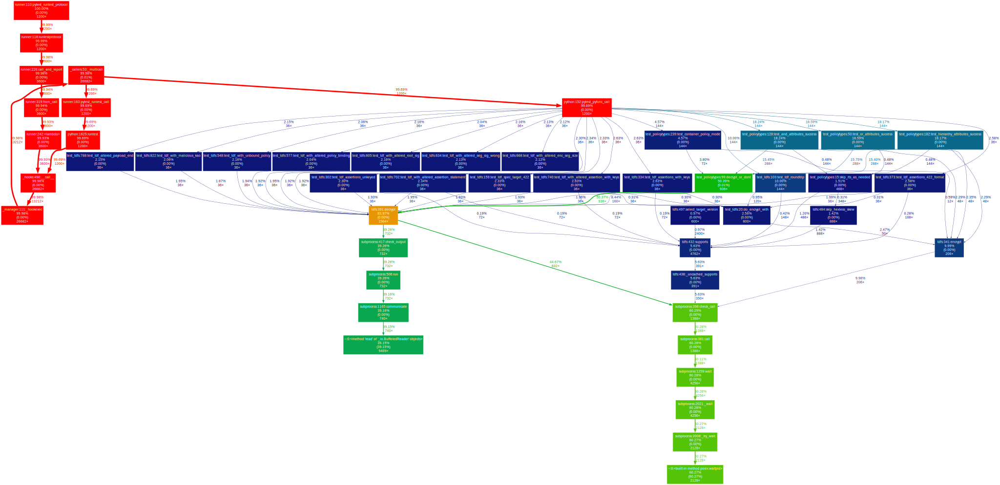

# Optimizing xtest testing

## Speed
### The current issue
There are a couple notable things we can see with our current testing methodology that make the process slower than desired.
1. There's a lot of test, 1200 if you are testing the main branch of every SDK and one other version
  - The tests themselves are actually quite sort, the long test averages about 6 seconds according to `pytest --duration`. But the sheer number of tests is what makes this process take a long time
2. The `decrypt` function is _extremely_ slow. This is most likely because of the fact that a.) any filesystem activity is going to be slower than using RAM or CPU
 *Generated with `pytest-profiling` package*
3. We run all of our tests serially, which underutilizes the resources we have available

### Recommendations
#### Split up tests
This should be a very fast win that should provide huge benefit. Right now, the test run one times, enumerates all available languages and versions, and then serially runs tests for all of those. I would propose instead using a GitHub Actions matrix to test each language, and each version separately. This would greatly reduce overall test time by running tests in parallel. On my local testing, this took my test time from 28:43 for all tests to 2:21 per test.
To solve this locally, we would need to determine some method for parallel testing. I've looked at `pytest-xdist` to parallelize tests, but this caused tests to fail and would probably require some decent refactoring.

#### Can we store the TDF in ramdisk?
We would need to test to see how much of an improvement this provides, but if we can store our encrypted TDF in a ramdisk, reading the file should be faster (again, we'd need to measure to determine just how fast).

#### Refactor tests
This is a much larger initiative, but since we have 1200 tests, it's entirely possible some of our tests are not needed in their current form and could be redesigned to reduce the number of tests.

## Readability
### The Current issue
Test results are very hard to read. Due to the nature of the tests, when a failure happens, it requires digging through logs to find the specific test. However many tests have similar names, and there are lots of logs, that make finding the exact testing scenario challenging.

### Recommendations
pytest has plugins available to make reporting easier. Here's a sample HTML that makes the test results more readable and also makes identifying specific failures. There are other plugins that we could use, this is largely up to the person who is reviewing the report to determine which result gives the best view of what they want.

To generate an HTML report locally, install `pytest-html` (already in `xtest/pyproject.toml`) and run:

```shell
pytest --html tmp/test-report.html --self-contained-html
```

## Skew
### The Current issue
As described, the main issue here is that it's difficult to understand what versions of the SDK should be tested against different platform versions and what features of the SDK should actually be tested. This is currently designated in the test itself, which leads to some features that should be tested, not actually being tested properly.

### Recommendations
#### Refactor
I think the best solution here is to refactor this process. Instead of hardcoding the tests to know which features should be tested, etc, this data should come from some type of easily customizable and reviewable config file (JSON/YAML/TOML/etc). This would allow anyone to easily review the config file and see what _should_ be tested, customize the test flow, etc. This could allow make readability much easier as we could use the config file and test results to generate a human readable report that gets published somewhere.

# Remaining questions
- Is xtest the right repo for this type of testing? As ultimately we're doing tests against the SDKs, should these tests not live inside of the SDK's themselves?
