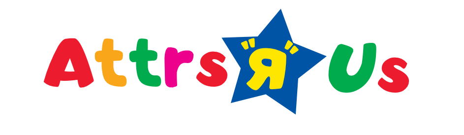

Abacus web application is used to interface with the EAS (entity attribute system) to guide users through attribute and entity management for their Virtru System. Chiefly responsible for helping users create, read, update, and delete users and entities from their TDF system while also allowing users to map attributes to entities.

## Storybook

Storybook for Abacus is hosted at https://virtru.github.io/etheria which is managed by [this workflow](../../abacus/web/.github/workflows/deploy-storybook.yml)

## Production Quick Start
For Abacus deploy we will need an EAS openapi.yml files. So go back to root project folder and run this command to generate package for deployment

```bash
zip -r abacusDeploy.zip ./abacus/web -x '*/node_modules/*' '*/.next/*' && zip -r abacusDeploy.zip ./eas/openapi.yaml
```

You can `sftp` or any other sutable way to place this archive to your server.
####In example we use Ubuntu sever.

Things you need to install for your sever:
- Node.js
```bash
sudo apt install nodejs
# Install node package mananager
sudo apt install npm
```
- Zip command line tool to unarchive package
```bash
sudo apt-get install zip
```
Now run your severs terminal, go to `abacusDeploy.zip` file location
```bash
unzip abacusDeploy.zip
# remove archive after unpacking
rm -rf abacusDeploy.zip

# go to abacus folder
cd abacus/web
```
 Create file with system variable, form more info [configuration](#configuration)
```bash
touch .env.production
nano .env.production
# Edit to match the FQDN of your “Reverse Proxy”, add to file this:
# NEXT_PUBLIC_API_BASE_URL="https://eas.example.com"
```
Then just run these commands
```bash
npm ci
npm run build
npm run start
```
Now your app running on port 3000 - setup reverse proxy to serve app on 80 and 443 ports

#### Local Backend

In your `/etc/hosts` file, add the following line:

```
127.0.0.1 etheria.local abacus.etheria.local
```

Then, from the etheria root, run

```sh
tools/genkeys-if-needed
docker-compose --build
```

This will bring up a KAS/EAS server running in testonly mode.

### Configuration

By default the remote production URL for the Abacus API is `/` if the Origin of Abacus Web and EAS are different you will need to modify your `.env.production` settings. (Read more about [Next.JS configuration](https://nextjs.org/docs/basic-features/environment-variables#default-environment-variables))

With default configuration, if the page is loaded on `https://etheria.local/abacus`, it will use `https://etheria.local/eas/` and `https://etheria.local/kas/` respectively.

Optionally these can be configured using environment variables at build time or in production NextJS server.

- NEXT_PUBLIC_API_BASE_URL - the base url which will use the service endpoint `https://etheria.local --> https://etheria.local/{eas, kas}`
- NEXT_PUBLIC_EAS_API_URL - the api endpoint for the eas service `https://eas.etheria.local --> https://eas.etheria.local`
- NEXT_PUBLIC_KAS_API_URL - the api endpoint for the kas service `https://kas.etheria.local --> https://kas.etheria.local`

## Testing

There are a couple of test suites:

- unit tests: `npm run test`
- integration tests: `npm run test-client`  -- [Read more]('./integrationTests/README.md')

## Development Quick Start

Install the dependencies:

```bash
npm install
```

Run the development server:

```bash
npm run dev
```

Open [http://etheria.local:3000](http://etheria.local:3000) with your browser to see the result.

### Develop React Components

To develop within the [Virtru React Components](https://github.com/virtru/react-components), the following command will:

- Clone the react-components library
- Checkout the appropriate branch
- Run `npm link` within the new repo
- Run `npm link react-components` within the Abacus directory

```bash
npm run dev:react-components
```

### React Project Convention

We using react hooks without state machine (redux, flux etc).
For hooks understanding - https://youtu.be/dpw9EHDh2bM

#### Hints
 - Useful to keep callbacks in `useCallback` so function wont created every time component rerender.
https://reactjs.org/docs/hooks-reference.html#usecallback
- Also if you want to prevent component rerender you should wrap it in
`useMemo` https://reactjs.org/docs/hooks-reference.html#usememo. In that case callback passed as property to such component SHOULD be wrapped to `useCallbacks`. Comparison of functions is similar to object comparison.
- If you feeling that `useEffect` is not enough for your complex logic (like multiple states depend on multiple variables, or you need multiple `useEffects`) dont be shy to use `useReducer`. Its perfect for those situations and `use-reducer-async` gives us ability to use async request with use reducer (its middleware that can make async request and dispatch event to reducer).

### Working with CSS Modules

All components must use CSS modules to support appropriate namespacing and loading in Storybook. Name your CSS file `[component].module.css` and store it in the same folder as your JavaScript and DOM content.

### Using Storybook to inspect components

```bash
npm run storybook
```

Open [localhost:6006](http://localhost:6006) to browse the current stories and components

## Learn More

This application is built upon [React](https://reactjs.org), [Next.js](https://nextjs.org), and [Virtru React Components](https://github.com/virtru/react-components). It is designed to be lite and simple to maintain.

### FAQ

#### What about an API?

We've chosen to utilize the EAS API to drive the management of attributes, however Abacus could be wired to another intermediary which EAS could interface with.

#### What about authentication?

Since EAS drives the entity authentication mechanism for KAS we've chosen to utilize the same mechanism to authenticate the user with EAS.

#### What about state management?

With the advent of React 16 inclusion of [React Hooks](https://reactjs.org/docs/hooks-intro.html) state management like Redux is largely unnecessary. We've chosen to use a similar pattern to [Unstated-Next](https://github.com/jamiebuilds/unstated-next).
