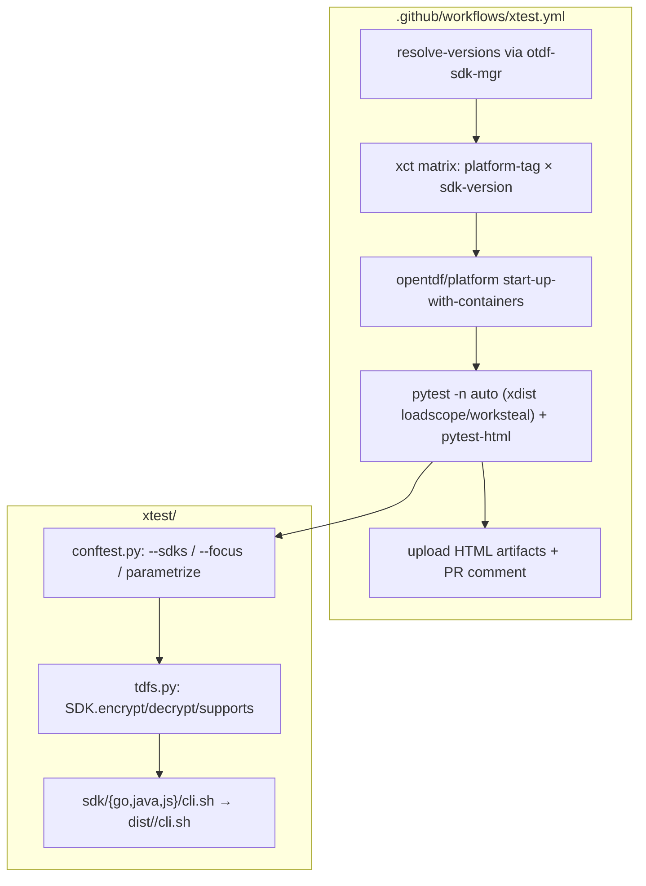
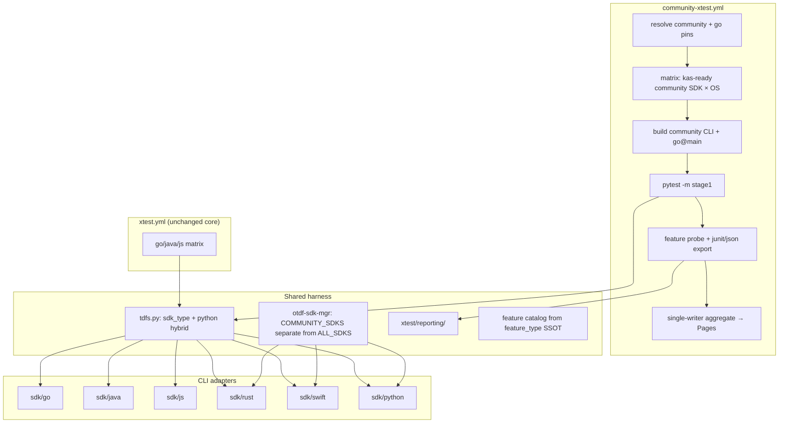
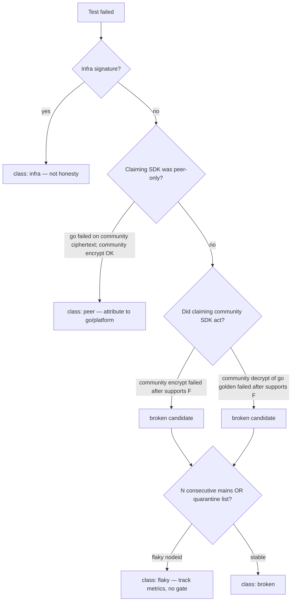
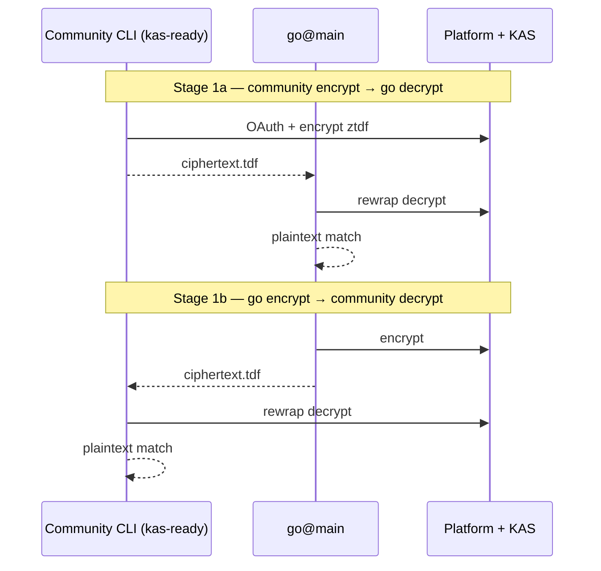
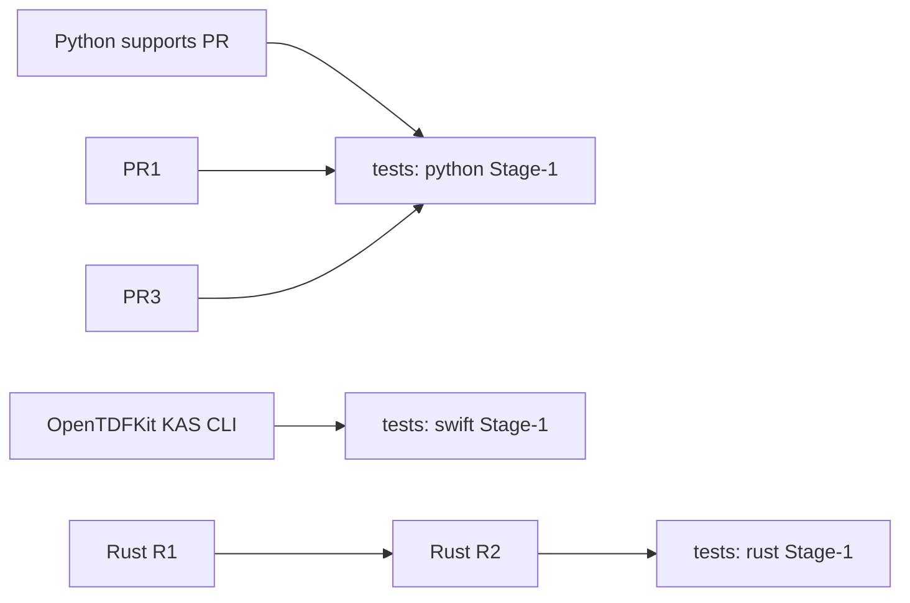

# Community OpenTDF SDKs → xtest Conformance Integration

| Field | Value |
|-------|-------|
| **Author** | arkavo-org / OpenTDF community (design owner: tests-fork maintainers) |
| **Date** | 2026-07-12 |
| **Status** | Draft (rev 3 — minor re-review fixes) |
| **Workspace** | `/Users/arkavo/Projects/opentdf` |
| **Primary target** | `opentdf-tests/` (fork of `opentdf/tests` → `arkavo-org/opentdf-tests`) |
| **Community SDKs** | `opentdf-rs/`, `OpenTDFKit/`, `opentdf-python-sdk/` |

---

## Overview

OpenTDF's official cross-SDK suite (`xtest`) currently exercises only the three first-party CLI adapters—Go (`otdfctl`), Java (`cmdline.jar`), and JS (`@opentdf/ctl`)—through a uniform `cli.sh` contract. Community SDKs (Rust, Swift, Python) implement substantial TDF crypto and, in Python's case, full platform auth via CLI—but they are not wired into the shared interop matrix. Adopters therefore cannot see, in one place, which platform features each SDK actually delivers, whether community encrypt×official decrypt (and the reverse) works, or how conformance is trending over time.

This design extends the fork's xtest harness with a **community tier**: three additional SDK adapters under `xtest/sdk/{rust,swift,python}/`, `otdf-sdk-mgr` checkout/install support (without changing default official install targets), a **separate** `community-xtest.yml` workflow that does not explode the official matrix, data-driven capability and interop reports published to GitHub Pages, and an honesty gate for false `supports` claims with flake/infra/peer classification.

**Near-term green path is Python only.** Rust ztdf and Swift ztdf are both **offline-style** today (static PEM / symmetric material, no client-credentials driven KAS PublicKey fetch + rewrap in the CLI). Each requires an SDK-repo PR series before Stage-1 KAS interop with `go@main`. Python hybrid mode (CLI default in CI; optional in-process for local speed) remains the velocity path for bugfix loops.

---

## Background & Motivation

### Current official architecture

The harness is centered on three layers:



**CLI contract** (documented in every `cli.sh`, invoked by `tdfs.SDK`):

```text
cli.sh encrypt <src> <dst> <fmt>
cli.sh decrypt <src> <dst> <fmt>
cli.sh supports <feature>    # exit 0 = yes, 1 = no, 2 = unknown
```

Configuration is environment-driven (`xtest/test.env` plus `XT_WITH_*` overrides):

| Variable | Role |
|----------|------|
| `CLIENTID` / `CLIENTSECRET` | OAuth client credentials |
| `PLATFORMURL` / `PLATFORMENDPOINT` | Platform base |
| `KASURL` / `KCFULLURL` / `TOKENENDPOINT` | KAS / IdP / token URL |
| `XT_WITH_ATTRIBUTES` | Comma-separated attribute FQNs |
| `XT_WITH_ASSERTIONS` | Assertions JSON or path |
| `XT_WITH_ECWRAP` | EC key wrapping |
| `XT_WITH_ECDSA_BINDING` | ECDSA policy binding |
| `XT_WITH_TARGET_MODE` | Spec target (`4.2.2` / `4.3.0`) |
| `XT_WITH_KAS_ALLOWLIST` **and** `XT_WITH_KAS_ALLOW_LIST` | Decrypt allowlist (**both names**; see § Env naming) |
| `XT_WITH_IGNORE_KAS_ALLOWLIST` | Bypass allowlist |
| `XT_WITH_VERIFY_ASSERTIONS` / `XT_WITH_ASSERTION_VERIFICATION_KEYS` | Assertion verification |
| `XT_WITH_MIME_TYPE` / `XT_WITH_PLAINTEXT_POLICY` | Encrypt options |

#### Env naming: KAS allowlist inconsistency (harness debt)

| Producer / consumer | Variable name |
|---------------------|---------------|
| `tdfs.SDK.decrypt` sets | `XT_WITH_KAS_ALLOWLIST` (no underscore between ALLOW and LIST) |
| go / java / js `cli.sh` read | `XT_WITH_KAS_ALLOW_LIST` (underscore between ALLOW and LIST) |
| OpenTDFKit `Config.swift` | Accepts **both** |

**Community shims MUST accept either name** (Swift pattern). Optional follow-up (upstreamable, out of community critical path): make `tdfs.py` set both, or align official `cli.sh` to one name.

**Type system** today (`xtest/tdfs.py`):

```python
sdk_type = Literal["go", "java", "js"]
feature_type = Literal[
    "assertions", "assertion_verification", "attribute_traversal",
    "audit_logging", "autoconfigure", "better-messages-2024", "bulk_rewrap",
    "connectrpc", "dpop", "dpop_nonce_challenge", "ecwrap", "hexless",
    "hexaflexible", "kasallowlist", "key_management",
    "mechanism-rsa-4096", "mechanism-ec-curves-384-521",
    "mechanism-xwing", "mechanism-secpmlkem", "mechanism-mlkem",
    "ns_grants", "obligations",
]
```

`SDK.supports()` probes `cli.sh supports <feature>` (with a few hard-coded overrides for known false positives, e.g. JS `v0.2.0` + `key_management`). Tests parametrize `encrypt_sdk × decrypt_sdk × container` (`ztdf`, `ztdf-ecwrap`) via `conftest.py`.

**otdf-sdk-mgr** (`config.py`) knows only official SDKs; `cli_install.py` uses `sdks or ALL_SDKS` for `stable` / `lts` / `tip`:

```python
ALL_SDKS = ["go", "js", "java"]  # must remain official-only
```

**CI matrix** (`.github/workflows/xtest.yml`): `platform-tag × sdk-version`. Official jobs already run **`pytest -n auto`** with `--dist loadscope` / `worksteal` (xdist is production, not aspirational). TESTING.md still notes historical flake risk and that earlier xdist attempts needed refactoring—both can be true. HTML reports are workflow artifacts with PR comment links. There is **no** GitHub Pages capability matrix and **no** historical bug-metrics store.

**TESTING.md** flags: ~1200 tests when all combos run, decrypt I/O-heavy, HTML readability, data-driven feature config for reports.

### Community SDK readiness (as of workspace review)

#### Python — `opentdf-python-sdk` (`b-long/opentdf-python-sdk`) — **Stage-1 candidate**

| Area | State |
|------|--------|
| CLI | `python -m otdf_python`: `encrypt` / `decrypt` / `inspect` |
| Auth | Full platform client credentials + KAS allowlist + autoconfigure flag |
| Contract gap | Flag shape differs from xtest positional contract; **no `supports` subcommand** |
| Global vs subcommand flags | Parent-parser globals (`--platform-url`, `--client-id`, …) must appear **before** the subcommand |
| Speed | Process-per-call re-inits SDK/auth |

**Implication:** Only community SDK near-term ready for Stage-1 KAS interop with go after modest CLI work (`supports` + env credential fallbacks).

#### Rust — `opentdf-rs` (`arkavo-org/opentdf-rs`) — **offline-only until R1+R2**

| Area | State |
|------|--------|
| CLI surface | `examples/xtest_cli.rs`: `encrypt` / `decrypt` / `supports` for `tdf|ztdf|json|cbor` |
| Auth / rewrap | **Offline path**: `TDF_KAS_URL`, `TDF_KAS_PUBLIC_KEY_PATH`, `TDF_SYMMETRIC_KEY_PATH` — not `CLIENTID`/`PLATFORMURL` OAuth |
| ZIP encrypt | Builds manifest + segments; **does not wrap payload key with KAS public key** (`encrypt_zip`); JSON/CBOR EC-wrap with provided PEM |
| KAS library | `KasClient` needs a **pre-acquired** `oauth_token` (passthrough); no client-credentials inside `KasClient` |
| Token acquisition | Exists in tests (`tests/platform_integration.rs::get_access_token`) and docs—not in `xtest_cli` |
| PublicKey fetch | `create_tdf_platform.rs` uses Connect `{root}/kas.AccessService/PublicKey` + RSA-OAEP wrap — **not wired into xtest_cli** |
| Feature names | Custom (`tdf`, `kas-rewrap`, `aes-256-gcm`, …) — **do not match** `feature_type` |
| **Honesty hazard** | `supports("kas-rewrap")` currently returns **true** while ZIP cannot be rewrapped by go — **R0 must flip this before any capability reporting** |
| Cargo features | Example requires `kas-client` (+ `cbor` for current example); docs sometimes say `kas` — pin `kas-client,cbor` |

#### Swift — `OpenTDFKit` (`arkavo-org/OpenTDFKit`) — **offline-only for ztdf until S1+S2**

| Area | State |
|------|--------|
| Production CLI | `OpenTDFKitCLI`: `encrypt` / `decrypt` / `supports` / `verify` |
| Config surface | `Config.swift` / help text **parse** `CLIENTID`, `CLIENTSECRET`, `KASURL`, `PLATFORMURL` |
| **ztdf encrypt reality** | `buildTDFConfiguration` requires `TDF_KAS_PUBLIC_KEY` / `TDF_KAS_PUBLIC_KEY_PATH` (static PEM); uses `TDF_KAS_URL`/`KASURL` only as URL string — **no PublicKey fetch, no OAuth client-credentials** |
| **ztdf decrypt reality** | Requires `TDF_SYMMETRIC_KEY_*` **or** (`TDF_PRIVATE_KEY`/`TDF_CLIENT_PRIVATE_KEY` PEM **plus** oauth token from `TDF_OAUTH_TOKEN` / `TDF_OAUTH_TOKEN_PATH` / `fresh_token.txt`) — **not** env-driven `CLIENTID`/`CLIENTSECRET` token acquisition |
| Client-credentials | Exists only in `OpenTDFKitTests/IntegrationTests.swift` (`getOAuthToken`), not CLI |
| Feature honesty | `supports` returns true for formats; false for almost all official `feature_type` values |
| Stub | `xtest/cli.swift` — incomplete; **not for CI** |
| Makefile | Kit-side `xtest/sdk/swift/Makefile` builds `OpenTDFKitCLI` → `dist/main` |
| Manifest | `TDFManifest.swift` camelCase `CodingKeys` — snake_case bug appears fixed; `opentdf-rs/docs/INTEROPERABILITY.md` still claims snake_case (**stale docs chore**) |

**Implication:** Prefer packaging `OpenTDFKitCLI` over the stub—but **do not** treat Swift as Stage-1 KAS-ready. Treat ztdf like Rust offline tier until an explicit OpenTDFKit PR implements OAuth + RSA KAS wrap/rewrap.

### Pain points this design addresses

1. Adopters cannot compare platform capabilities vs community SDK delivery in one report.
2. No go↔community encrypt×decrypt confidence for SDKs that actually speak KAS (python near-term; rust/swift after SDK work).
3. HTML artifacts are per-matrix-cell dumps; no durable capability/interop/bug-metrics dashboard.
4. Official matrix is already large; naively adding 3 SDKs multiplies cost.
5. Python process-per-call latency slows maintainer feedback loops.
6. Offline CLIs (rust/swift ztdf) would produce false confidence if branded as full KAS interop.

---

## Goals & Non-Goals

### Goals

1. Extend `sdk_type` with community tier: `rust`, `swift`, `python` (fork-first; acceptable for eventual upstream PR as a small Literal merge).
2. Provide `xtest/sdk/{rust,swift,python}/` shims matching official `Makefile` + `cli.sh` + `dist/<ver>/`.
3. Extend `otdf-sdk-mgr` for community checkout/install **without** expanding default `ALL_SDKS` install targets.
4. Data-driven capability matrix + interop matrix + bug metrics on GitHub Pages.
5. Keep official `xtest.yml` matrix size stable via separate `community-xtest.yml`.
6. Stage interop: (1) community ↔ go@main for **kas-ready** SDKs only; (2) community × community when ≥2 community SDKs are kas-ready.
7. Python hybrid execution modes (CLI CI / in-process local).
8. Honesty gate for false `supports`, with infra/peer/flake classification and staged severity.
9. Explicit Rust and Swift KAS CLI plans; honest offline tiers until rewrap lands.
10. Prefer Swift `OpenTDFKitCLI` over stub; document that ztdf is offline today.

### Non-Goals

1. Merging community SDKs into upstream `opentdf/tests` in the first delivery.
2. Full official ABAC/PQC/DPoP matrices for community on day one.
3. Implementing all platform features inside community SDKs (measure and stage).
4. Changing official go/java/js `cli.sh` contracts beyond optional shared report plumbing / allowlist dual-set in `tdfs.py`.
5. NanoTDF / CBOR / JSON container coverage in Stage-1 (ztdf only).
6. Making community SDKs part of official LTS release matrix.
7. Hard-gating honesty on day one of community-xtest (warn first).

### Success metrics (phased)

| Horizon | Metric |
|---------|--------|
| **30 days** | Python Stage-1 basic ztdf green on main; report export artifacts on every community job; Pages skeleton with python-only data |
| **60 days** | Honesty gate in **warn** with classification; Pages history ≥14 days; optional offline rust/swift capability probes only |
| **90 days** | Honesty **error** for Stage-1 python cells; Rust **or** Swift kas-partial Stage-1 if SDK PRs land (not both required); open critical failures trending down |
| **Stretch** | Second community SDK kas-ready → Stage-2 optional nightly |

---

## Proposed Design

### Architecture layers



**Design principle:** Keep go/java/js paths upstream-mergeable. Community code is additive. Shared `tdfs.py` / `conftest.py` changes stay small.

### SDK tier model

```python
OfficialSDK = Literal["go", "java", "js"]
CommunitySDK = Literal["rust", "swift", "python"]
sdk_type = Literal[OfficialSDK, CommunitySDK]

SDK_TIER = {
    "go": "official", "java": "official", "js": "official",
    "rust": "community", "swift": "community", "python": "community",
}

# Matrix inclusion readiness (orthogonal to supports())
InteropTier = Literal[
    "kas-full",      # Official env + KAS rewrap encrypt/decrypt for ztdf
    "kas-partial",   # Stage-1 basic ztdf works; advanced features limited
    "offline-only",  # PEM/symmetric path — excluded from Stage-1 KAS interop
]
```

| SDK | Initial interop tier | Stage-1 KAS eligible |
|-----|----------------------|----------------------|
| go / java / js | `kas-full` | Yes (go is peer) |
| **python** | `kas-partial` | **Yes** (after PR4 supports + env) |
| **swift** | `offline-only` for ztdf | **No** until OpenTDFKit S1+S2 (PR10a) |
| **rust** | `offline-only` | **No** until Rust R1+R2 (PR12a/b) |

### CLI shim layout (tests fork)

```text
xtest/sdk/
  Makefile                 # all: js go java   |   community: rust swift python
  go/ java/ js/            # upstream-compatible
  rust/  {Makefile, cli.sh}
  swift/ {Makefile, cli.sh}
  python/{Makefile, cli.sh}
```

Each `cli.sh` must:

1. Locate xtest root (`pyproject.toml` name = `"xtest"`).
2. Source `test.env`.
3. Implement `supports` against canonical `feature_type` (unknown → exit 2).
4. Map `XT_WITH_*` including **both** allowlist env names.
5. Invoke dist-local binary/interpreter; never echo secrets.

#### Rust `cli.sh`

```bash
# R0: supports for every official feature_type → exit 1
# Offline encrypt/decrypt only if XT_ALLOW_OFFLINE=1
# Post-R2: CLIENTID/CLIENTSECRET/PLATFORMURL/KASURL/TOKENENDPOINT path
BINARY="$SCRIPT_DIR/xtest_cli"
"$BINARY" "$@"
```

Makefile pin (Key Decision):

```make
cargo build --release --example xtest_cli --features kas-client,cbor
```

#### Swift `cli.sh`

```bash
BINARY="$SCRIPT_DIR/OpenTDFKitCLI"
# Accept XT_WITH_KAS_ALLOWLIST or XT_WITH_KAS_ALLOW_LIST
# Until S2: offline ztdf only under XT_ALLOW_OFFLINE=1; Stage-1 job disabled
"$BINARY" "$1" "$2" "$3" "$4"
```

Do **not** use `xtest/cli.swift` stub for CI.

#### Python `cli.sh` (canonical invocation order)

Parent-parser globals **before** subcommand (argparse default; no `parse_intermixed_args` today):

```bash
PY="${SCRIPT_DIR}/.venv/bin/python"
# Prefer env credential fallbacks added in PR4; never put CLIENTSECRET on argv
export CLIENTID CLIENTSECRET PLATFORMURL KASURL

case "$1" in
  supports)
    exec "$PY" -m otdf_python supports "$2"
    ;;
  encrypt)
    args=(--platform-url "$PLATFORMURL" --kas-endpoint "$KASURL" --plaintext)
    # credentials via env (PR4) or temp creds file written 0600 if needed
    [[ -n "${XT_WITH_ATTRIBUTES:-}" ]] && args+=(--attributes "$XT_WITH_ATTRIBUTES")
    [[ "${XT_WITH_ECDSA_BINDING:-}" == "true" ]] && args+=(--policy-binding ecdsa)
    exec "$PY" -m otdf_python "${args[@]}" encrypt "$2" -o "$3"
    ;;
  decrypt)
    args=(--platform-url "$PLATFORMURL" --kas-endpoint "$KASURL" --plaintext)
    allow="${XT_WITH_KAS_ALLOWLIST:-${XT_WITH_KAS_ALLOW_LIST:-}}"
    [[ -n "$allow" ]] && args+=(--kas-allowlist "$allow")
    [[ "${XT_WITH_IGNORE_KAS_ALLOWLIST:-}" == "true" ]] && args+=(--ignore-kas-allowlist)
    exec "$PY" -m otdf_python "${args[@]}" decrypt "$2" -o "$3"
    ;;
esac
```

Notes:

- `--plaintext` means **HTTP** (not TLS), matching Python CLI—not attributes.
- Many official `feature_type` values have no CLI flag yet → PR4 `supports` must stay conservative (return 1).

### otdf-sdk-mgr extensions

**Keep `ALL_SDKS` official-only** so `otdf-sdk-mgr install tip|stable|lts` without args does not try rust/swift/python and fail on missing toolchains.

```python
# config.py
OFFICIAL_SDKS = ["go", "js", "java"]
ALL_SDKS = OFFICIAL_SDKS  # unchanged semantics for install tip/stable/lts defaults

COMMUNITY_SDKS = ["rust", "swift", "python"]

SDK_GIT_URLS |= {
    "rust": os.environ.get("OTDF_RUST_GIT_URL", "https://github.com/arkavo-org/opentdf-rs.git"),
    "swift": os.environ.get("OTDF_SWIFT_GIT_URL", "https://github.com/arkavo-org/OpenTDFKit.git"),
    "python": os.environ.get("OTDF_PYTHON_GIT_URL", "https://github.com/b-long/opentdf-python-sdk.git"),
}

SDK_BARE_REPOS |= {
    "rust": "opentdf-rs.git",
    "swift": "OpenTDFKit.git",
    "python": "opentdf-python-sdk.git",
}

def get_sdk_dirs() -> dict[str, Path]:
    sdk_dir = get_sdk_dir()
    names = OFFICIAL_SDKS + COMMUNITY_SDKS
    return {name: sdk_dir / name for name in names}
```

**CLI:**

```bash
otdf-sdk-mgr install tip              # go, js, java only
otdf-sdk-mgr install tip rust         # explicit community
otdf-sdk-mgr checkout python main
otdf-sdk-mgr versions resolve swift main
```

`install stable` / release installers remain official-only until community packages exist on crates.io / PyPI / GitHub Releases. Community head builds: `checkout` + `make -C xtest/sdk/<lang>` (not `INSTALLERS` map).

Unit tests: mock `make`/git; assert default tip does not include community.

### Feature catalog (single source of truth)

Do **not** hand-maintain a partial YAML that drifts from `feature_type`.

```text
xtest/capabilities/
  generate_catalog.py   # emits feature_catalog.json from typing.get_args(tdfs.feature_type)
  feature_catalog.json  # generated in CI and optionally committed
```

Descriptions may live in a small optional overlay map for human text only; **ids always come from `feature_type`**.

### Reporting layout (flat suite — not `python -m xtest.…`)

xtest is an **unpackaged flat suite** (`pyproject.toml`: “not a distributable package”). Modules live at the suite root (`tdfs.py`, `conftest.py`); there is **no** installable `xtest` Python package namespace. Reporting code must follow the same pattern:

```text
xtest/                          # cwd for uv run / pytest
  tdfs.py
  conftest.py
  reporting/                    # regular package (reporting/__init__.py)
    __init__.py
    probe_supports.py
    honesty.py                  # pytest plugin (listed in conftest pytest_plugins or -p)
    generate_site.py
    junit_interop.py
    metrics.py
    flake_quarantine.txt
  capabilities/
    generate_catalog.py
```

**Canonical invocations** (always `working-directory: …/xtest`, after `uv sync`):

```bash
# Pre-test feature probe
uv run python -m reporting.probe_supports \
  --sdk python --version main \
  --cli sdk/python/dist/main/cli.sh \
  -o report-out/supports.json

# Catalog (CI or pre-commit)
uv run python capabilities/generate_catalog.py -o capabilities/feature_catalog.json

# Pages aggregate (pages-aggregate job; inputs = downloaded report-* dirs)
uv run python -m reporting.generate_site \
  --inputs ../artifacts \
  --out _site

# pytest discovers honesty via conftest (preferred):
#   pytest_plugins = [..., "reporting.honesty"]
# or: uv run pytest -p reporting.honesty ...
```

Do **not** use `python -m xtest.reporting.*` — that path does not exist unless someone later packages the suite (out of scope). Optional later: `[project.scripts]` entry points only if packaging is adopted; default remains flat `-m reporting.*` from cwd.

### Report artifact contract

Each `community-xct` matrix job uploads **one** artifact directory:

```text
report-{sdk}-{os}/          # artifact name: report-python-ubuntu-latest
  junit.xml                 # pytest --junitxml=
  pytest.html               # pytest-html self-contained
  supports.json             # pre-test probe of all feature_type values
  honesty.json              # session plugin output (may be empty findings)
  meta.json                 # sdk, version, sha, platform ref/sha, go sha, run_id, interop_tier
```

**Who builds what:**

| File | Producer |
|------|----------|
| `supports.json` | Pre-pytest step: `uv run python -m reporting.probe_supports …` (cwd = `xtest/`) |
| `junit.xml` / `pytest.html` | pytest |
| `honesty.json` | pytest plugin `reporting.honesty` (xdist-safe; workers send to controller) |
| `interop.json` | **Aggregate job only** — `python -m reporting.junit_interop` over all `junit.xml` |
| `capability.json` | Aggregate — merge `supports.json` + honesty classifications |
| `versions.json` | Aggregate — from all `meta.json` |

#### junit → interop mapping

Parametrized nodeids look like:

```text
test_tdfs.py::test_tdf_roundtrip[python@main-go@main-ztdf-small-…]
```

Parser rules:

1. Only count tests marked `stage1` (or nodeids matching the Stage-1 allowlist).
2. Extract `encrypt_sdk`, `decrypt_sdk`, `container` from pytest param names / properties.
3. Bucket outcomes: `passed` / `failed` / `skipped` / `error`.
4. Emit one matrix cell per `(encrypt, decrypt, container)`.

Example cell:

```json
{
  "encrypt": "python@main",
  "decrypt": "go@main",
  "container": "ztdf",
  "passed": 1,
  "failed": 0,
  "skipped": 0,
  "errors": 0,
  "tests": ["test_tdf_roundtrip[python@main-go@main-ztdf-…]"]
}
```

**Skip policy for Pages:** display skip counts but **health badge** uses `failed+errors == 0` among non-skipped stage1 tests. Mass-skips (unsupported features) do not red-badge.

#### Capability status transitions

| Status | Rule |
|--------|------|
| `unsupported` | probe exit 1 (or 2 → unsupported + warning) |
| `untested` | probe said supported (or not run) but no stage1 test exercised feature |
| `supported` | probe exit 0 **and** at least one claiming-actor test passed for that feature **and** no `broken` |
| `partial` | probe exit 0; subset of related tests skipped with documented reason (manual/override list) |
| `broken` | classified honesty failure (see below) |

### Honesty gate (false-advertising) — full classification



**Rules:**

1. **Only the claiming actor** can earn `broken`. If community encrypt succeeded and go decrypt failed, classify `peer` (or `infra` if KAS logs show rewrap errors from platform). Do not mark community `broken` for peer decrypt failure of a well-formed TDF.
2. **Infra signatures:** connection refused, token endpoint 5xx, docker/platform health fail, missing `PLATFORMURL`, setup timeouts. Plugin reads pytest longrepr + optional env `XT_INFRA_HINT=1` set by workflow when platform step fails.
3. **Flake detection:** fingerprint = normalized nodeid (sdk channel not SHA). `flaky` if fails then passes within 3 consecutive main runs, or nodeid on quarantine list `reporting/flake_quarantine.txt`. Require **N≥2 consecutive main failures** before honesty `error` severity counts a `broken`.
4. **xdist safety:** use `pytest_sessionfinish` on controller only; workers report via `workeroutput` / `pytest-xdist` node hooks. Never `sys.exit` from worker.
5. **Severity rollout (Key Decision):** `XT_COMMUNITY_HONESTY=warn` for first **4 weeks** after community-xtest is enabled on main; then `error` for Stage-1 python cells. Offline-tier jobs never error on honesty for official features they correctly reject.
6. **Rollback:** set `XT_COMMUNITY_HONESTY=warn` or `off` in workflow env without code revert.

#### Actor-vs-peer detection for monadic `test_tdf_roundtrip`

Stage-1 still uses a **single** test that encrypts then decrypts. On failure the honesty plugin must classify **which leg failed** before applying actor/peer rules. Detection order (first match wins):

| Priority | Signal | How | Classification hint |
|----------|--------|-----|---------------------|
| 1 | `subprocess.CalledProcessError.cmd` in longrepr / `reprcrash` | Look for `cli.sh` (or binary) argv containing `encrypt` vs `decrypt` as the subcommand token | encrypt leg → actor = `encrypt_sdk`; decrypt leg → actor = `decrypt_sdk` |
| 2 | xtest log lines in captured stdout/stderr | `tdfs.py` logs `enc […]` before encrypt and `dec […]` before decrypt; if failure follows an `enc` line with no successful `dec`, treat as encrypt leg; if `dec` appears, treat as decrypt leg | same as above |
| 3 | Ciphertext artifact existence | `EncryptFactory` / test tmp path: if `ct_file` missing or empty → encrypt leg; if `ct_file` exists and `rt_file` missing/mismatch → decrypt leg | same |
| 4 | Ambiguous | No clear enc/dec signal | class = **`unclassified`** (during warn soak) or **`infra`** — **never** `broken` |

**Pair with Stage-1 1a/1b** (narrows roles but does not replace leg detection):

- **1a** `--sdks-encrypt community --sdks-decrypt go`: community is only blamed for `broken` on **encrypt-leg** failures (or if community claimed a feature required only on encrypt). Go decrypt-leg failure → `peer` (or `infra`).
- **1b** `--sdks-encrypt go --sdks-decrypt community`: community is only blamed on **decrypt-leg** failures. Go encrypt-leg failure → `peer`.

**Optional later hardening (not required for PR6):** split stage1 into `test_stage1_community_encrypt` (assert manifest/schema only) + `test_stage1_peer_decrypt` so junit nodeids encode the leg. Until then, use the table above.

**Pseudo for plugin:**

```python
def classify_leg(report: pytest.TestReport) -> Literal["encrypt", "decrypt", "unknown"]:
    text = (report.longreprtext or "") + "".join(report.sections and …)
    # 1) cmd path
    if re.search(r"cli\.sh['\"]?\s+encrypt\b|/encrypt\b", text):
        if not re.search(r"cli\.sh['\"]?\s+decrypt\b", text):
            return "encrypt"
    if re.search(r"cli\.sh['\"]?\s+decrypt\b", text):
        return "decrypt"
    # 2) tdfs log markers
    if "enc [" in text and "dec [" not in text:
        return "encrypt"
    if "dec [" in text:
        return "decrypt"
    return "unknown"
```

### Stage-1 test selection

Do **not** run full `test_tdfs.py` for community Stage-1.

```python
# conftest.py or pytest.ini
# marker: stage1 — basic ztdf roundtrip community ↔ go only

# test_tdfs.py
@pytest.mark.stage1
def test_tdf_roundtrip(...):
    ...
```

Community CI:

```bash
uv run pytest -n auto --dist loadscope \
  -m stage1 \
  --containers ztdf \
  --sdks-encrypt "python@main" --sdks-decrypt "go@main" \
  --junitxml=report-out/junit.xml \
  --html=report-out/pytest.html --self-contained-html \
  --export-report report-out \
  test_tdfs.py

# inverted 1b
uv run pytest -n auto --dist loadscope -m stage1 \
  --containers ztdf \
  --sdks-encrypt "go@main" --sdks-decrypt "python@main" \
  ...
```

Optional explicit allowlist if markers are too invasive for upstream merge:

```text
xtest/reporting/stage1_nodeids.txt
test_tdfs.py::test_tdf_roundtrip
```

Later: expand markers for assertions/ecwrap only when community claims those features.

### Interop stages



**Stage-0 (optional, offline SDKs):** golden/fixture decrypt-only or offline self-roundtrip under `XT_ALLOW_OFFLINE=1` — **not** branded as KAS interop on Pages (label `offline`).

**Stage-2:** when ≥2 community SDKs are kas-ready for Base TDF — **enabled** (python × rust on ubuntu; python × rust × swift on macos). Same `test_tdf_roundtrip` / `-m stage1` cell; encrypt/decrypt peers are community-only (go remains for attribute fixtures).

### Python hybrid mode (detailed)

| Mode | When | Requires dist cli.sh? |
|------|------|------------------------|
| `cli` (default) | CI, parity | Yes — full path `sdk/python/dist/<ver>/cli.sh` |
| `inprocess` | Local bugfix | **Supports** still via CLI if present; encrypt/decrypt may use import path |

**Constructor change:**

```python
class SDK:
    def __init__(self, sdk: sdk_type, version: str = "main", *, require_cli: bool | None = None):
        self.sdk = sdk
        self.version = version
        self.path = f"sdk/{sdk}/dist/{version}/cli.sh"
        cli_required = require_cli if require_cli is not None else (
            not (sdk == "python" and _python_mode() == "inprocess")
        )
        if cli_required and not os.path.isfile(self.path):
            raise FileNotFoundError(...)
        # inprocess: path optional; supports() falls back to inprocess feature table
```

**Import / install for inprocess:**

- Optional extra in `xtest/pyproject.toml`: `[project.optional-dependencies] python-sdk = ["otdf-python"]`  
- Or local: `uv pip install -e ../opentdf-python-sdk/packages/otdf-python` and `XT_PYTHON_MODE=inprocess`.
- CI Stage-1 **always** `XT_PYTHON_MODE=cli`.

**In-process mapping (PR9):**

| XT_WITH / env | Builder / API |
|---------------|---------------|
| `PLATFORMURL` | `SDKBuilder.platform_endpoint` / `set_platform_endpoint` |
| `KASURL` | KAS info on encrypt config |
| `CLIENTID`/`CLIENTSECRET` | `client_secret(...)` |
| `XT_WITH_ATTRIBUTES` | attributes on TDF config |
| `XT_WITH_ECDSA_BINDING` | policy binding where supported |

**Lifecycle:** per-call `SDKBuilder` with a **session-scoped token source cache** (reuse access token until expiry). Avoid sharing mutable SDK clients across tests to limit state bugs; cache only tokens/http transport if available.

### Rust KAS path plan (expanded)

#### Phase R0 — Offline tier + honesty baseline (blocking for any reporting)

Acceptance:

1. Official `feature_type` probes via `cli.sh supports` → **all exit 1**.
2. Custom names (`kas-rewrap`, `tdf`, …) either removed from default `supports` or only true when `XT_ALLOW_OFFLINE=1` and **never** mixed into capability.json official grid.
3. `interop_tier: offline-only`; excluded from Stage-1 matrix.
4. Cargo: `cargo build --release --example xtest_cli --features kas-client,cbor`.

#### Phase R1 — Encrypt with KAS PublicKey wrap (SDK PR12a)

Port from `create_tdf_platform.rs`:

1. Async runtime: convert `main` to `#[tokio::main]` (or `block_on`).
2. Read `KASURL` / `PLATFORMURL` (official names; keep `TDF_*` aliases).
3. Connect PublicKey: `{platform_root}/kas.AccessService/PublicKey` (strip trailing `/kas` as in example)—**not** legacy REST `/kas/v2/kas_public_key` from older tests.
4. RSA-OAEP wrap payload key into `wrapped_key` on key access object; camelCase manifest.
5. Optional `XT_WITH_ECWRAP=true` → EC wrap path when ready (may lag RSA).
6. Write ztdf; go@main must decrypt (manual or Stage-1a preview).

Files: `examples/xtest_cli.rs`, reuse `opentdf::kas_key::fetch_kas_public_key_connect`, `wrap_key_with_rsa_oaep`.

#### Phase R2 — Decrypt via KasClient + token acquisition (SDK PR12b)

`KasClient::new` does **not** do OAuth. Implement helper (new module e.g. `examples/xtest_oauth.rs` or `src/oauth_client_credentials.rs`):

```text
resolve_token_endpoint():
  1. TOKENENDPOINT if set (test.env)
  2. else KCFULLURL + "/protocol/openid-connect/token"
  3. else PLATFORMURL well-known opentdf-configuration / OIDC discovery if available

client_credentials_grant(token_url, CLIENTID, CLIENTSECRET) -> access_token
  POST application/x-www-form-urlencoded
  grant_type=client_credentials

KasClient::new(config, access_token)
  rewrap_standard_tdf / per-key-access rewrap
  decrypt segments → plaintext file
```

Reference: `tests/platform_integration.rs::get_access_token` (form POST pattern). Prefer `TOKENENDPOINT` from `test.env` for xtest parity.

#### Phase R3 — Feature alignment

Only flip `supports` for official features after stage1 tests pass.

### Swift KAS path plan (mirror Rust; **blocks Stage-1**)

#### Phase S0 — Offline documentation

- Prefer OpenTDFKitCLI; mark `xtest/cli.swift` deprecated for CI.
- ztdf remains PEM/symmetric offline; capability tier `offline-only`.
- `supports` stays false for official platform features.

#### Phase S1 — Encrypt: OAuth optional + RSA PublicKey fetch + wrap (SDK PR10a part 1)

1. Port client-credentials from `IntegrationTests.getOAuthToken` into CLI (shared helper).
2. Fetch KAS public key (Connect preferred for platform main; align with kit's `KASService` / rewrap client).
3. RSA-OAEP wrap for go interop (not nano EC-only path).
4. Stop requiring `TDF_KAS_PUBLIC_KEY` when `CLIENTID`+`PLATFORMURL`+`KASURL` present.

#### Phase S2 — Decrypt: client-credentials + correct KAS rewrap unwrap (SDK PR10a part 2)

**Problem today:** `Commands.decryptTDF` generates a **P256** ephemeral for `rewrapTDF`, then unwraps `kasWrappedKey` with **RSA** `TDF_PRIVATE_KEY` via `TDFCrypto.unwrapSymmetricKeyWithRSA`, and **ignores** session/public material returned by rewrap. Nano paths already do the right thing with `KASRewrapClient.unwrapKey(wrappedKey:sessionPublicKey:clientPrivateKey:)`. S2 must **not** re-ship the RSA-private-key shortcut for Stage-1 ztdf.

**S2 acceptance criteria (all required):**

1. **OAuth:** acquire access token via client-credentials (`CLIENTID`/`CLIENTSECRET` + `TOKENENDPOINT`/`KCFULLURL`); do not require `TDF_OAUTH_TOKEN` / `fresh_token.txt` for Stage-1.
2. **No pre-provisioned payload key:** Stage-1 ztdf decrypt must work **without** `TDF_SYMMETRIC_KEY` / `TDF_SYMMETRIC_KEY_PATH`.
3. **No pre-provisioned KAS private key for rewrap unwrap:** must **not** require `TDF_PRIVATE_KEY` / `TDF_CLIENT_PRIVATE_KEY` to finish rewrap-based decrypt (those remain optional only for pure offline / local unwrap experiments under `XT_ALLOW_OFFLINE=1`).
4. **Ephemeral session keypair matches rewrap algorithm:**
   - Inspect each KAO (`wrapped` RSA vs `ec-wrapped`).
   - Generate the client ephemeral keypair required by that rewrap mode (EC-P256 session for standard go-compatible rewrap; RSA only if protocol demands it).
   - Pass the matching **public** key into `KASRewrapClient.rewrapTDF` (or successor API).
5. **Unwrap with the matching ephemeral private key**, not a static RSA PEM:
   - Prefer `KASRewrapClient.unwrapKey(wrappedKey:sessionPublicKey:clientPrivateKey:)` (already used for nano) using the **session public key from the rewrap response** (or the local ephemeral public) and the **local ephemeral private**.
   - If split keys / multi-KAO, combine per existing TDF rules after each unwrap.
6. **Payload decrypt:** feed recovered symmetric key into `TDFDecryptor` / streaming decrypt; write plaintext file for xtest.

**Files to touch:** `OpenTDFKitCLI/Commands.swift` (`decryptTDF`), possibly `KASRewrapClient.swift` if ztdf rewrap result needs to expose `sessionPublicKey` the way nano does. Port token helper from `IntegrationTests.getOAuthToken`.

**Non-goals for S2:** implementing every official `feature_type`; nano-only paths already closer—do not let nano success count as S2.

Gate: S1+S2 green against go@main (community encrypt→go decrypt and go encrypt→community decrypt) before Swift matrix cell in community-xtest.

### Swift / macOS platform ops (v1 procedure)

**Decision:** v1 Swift Stage-1 runs on `macos-latest (native Postgres+Keycloak, no Docker)` **self-contained** (Colima + platform + OpenTDFKitCLI). arm64 `macos-latest` cannot run Colima nested virt on GHA.

| Step | Detail |
|------|--------|
| Platform | Install Docker (or Colima) on macOS runner **or** build/run platform Go binary natively if composite is linux-only |
| Default procedure | **Try** `opentdf/platform/test/start-up-with-containers` on macOS with Docker; if composite assumes Linux-only cgroup/network, fall back to **`otdf-local up`** with Docker Desktop/Colima (fork already vendors otdf-local) |
| Timeout budget | 25 min platform boot + provision; 15 min SPM build (cache `~/.swiftpm`, DerivedData); 15 min pytest; job timeout 60–75 min |
| Caches | SPM, Go modules, platform image layers |
| Failure modes | Docker daemon not ready → retry 3×; port bind conflicts → `otdf-local down`; SPM resolve fail → clear cache |
| Stretch | Linux Swift container on ubuntu sharing network with platform sidecars |

Ubuntu jobs (python/rust Stage-1) keep official composite action unchanged.

### CI strategy

#### Official `xtest.yml`

Unchanged matrix. Optional PR comment link to Pages URL on main.

#### New `community-xtest.yml`

Stage-1 still runs `test_tdf_roundtrip` (marked `stage1`), which needs the **same platform/fixture env as official “Run all standard xtests”**—not the multi-KAS ABAC job. Without these wires, fixtures fail before any interop assertion.

**Required env / fixtures (parity with official xtest.yml standard jobs):**

| Need | Source in official workflow | Community PR5 requirement |
|------|----------------------------|---------------------------|
| Platform process + ports | `opentdf/platform/test/start-up-with-containers` | Same composite (ubuntu) |
| `PLATFORM_DIR` | `../../${{ steps.run-platform.outputs.platform-working-dir }}` | **Required** — fixtures (`fixtures/kas.py`) load `kas-cert.pem` from `$PLATFORM_DIR`; audit auto-discovers `$PLATFORM_DIR/logs` |
| `PLATFORM_VERSION` | `go run ./service version` in platform dir | Set for `PlatformFeatureSet` |
| `test.env` | sourced by each `cli.sh` | Ensure `CLIENTID`/`CLIENTSECRET`/`PLATFORMURL`/`KASURL`/`TOKENENDPOINT`/`KCFULLURL` present (default file in suite) |
| go@main / otdfctl | setup-cli-tool + `make` in `sdk/go` | **Required** — `attribute_default_rsa` and related fixtures use otdfctl policy setup via go CLI |
| `SCHEMA_FILE` | `manifest.schema.json` on standard xtest step | Set when schema validation runs (roundtrip path uses manifest helpers) |
| Audit / rewrap asserts | `PLATFORM_LOG_FILE` or auto-discovery under `PLATFORM_DIR/logs` | Prefer explicit `PLATFORM_LOG_FILE` from composite platform log output when available; else rely on `PLATFORM_DIR` auto-discovery (`fixtures/audit.py` / `audit_logs.py`). Stage-1 does **not** need multi-KAS (`KAS_ALPHA_LOG_FILE`, …) or ABAC/PQC jobs |
| Optional escape hatch | `--no-audit-logs` / `DISABLE_AUDIT_ASSERTIONS=1` | Only for local offline debugging—not default in community CI |

**Not required for Stage-1:** additional KAS (alpha/beta/…), `test_abac.py` / `test_pqc.py` / `test_dpop.py`, key-management root-key matrix.

```yaml
name: Community X-Test
on:
  pull_request:
    paths: [xtest/**, otdf-sdk-mgr/**, .github/workflows/community-xtest.yml]
  schedule: [{ cron: "0 7 * * *" }]
  workflow_dispatch:
    inputs:
      community-sdks: { default: "python" }  # expand when kas-ready
      stage: { default: "1" }
      honesty: { default: "warn" }           # warn | error | off

permissions:
  contents: read
  packages: read
  checks: write
  pull-requests: write
  pages: write          # only pages-aggregate job needs this
  id-token: write       # deploy-pages

jobs:
  community-xct:
    strategy:
      fail-fast: false
      matrix:
        include:
          - sdk: python
            os: ubuntu-latest
            interop_tier: kas-partial
          # rust Stage-1: only after PR12b + tier flip
          # swift Stage-1: only after PR10a + tier flip
    steps:
      - checkout tests fork
      - uses: opentdf/platform/test/start-up-with-containers@…  # same pin family as official
        id: run-platform
      - setup-python / uv / go / (java|node only if needed for go peer tooling)
      - install go@main CLI into xtest/sdk/go/dist/main   # otdfctl for attribute fixtures
      - install community SDK into xtest/sdk/${{ matrix.sdk }}/dist/main
      - name: Platform version
        working-directory: ${{ steps.run-platform.outputs.platform-working-dir }}
        run: echo "PLATFORM_VERSION=$(go run ./service version 2>&1)" >> "$GITHUB_ENV"
      - name: Probe supports
        working-directory: otdftests/xtest
        run: |
          mkdir -p report-out
          uv run python -m reporting.probe_supports \
            --sdk "${{ matrix.sdk }}" --version main \
            --cli "sdk/${{ matrix.sdk }}/dist/main/cli.sh" \
            -o report-out/supports.json
      - name: Stage-1a community encrypt → go decrypt
        working-directory: otdftests/xtest
        env:
          PLATFORM_DIR: "../../${{ steps.run-platform.outputs.platform-working-dir }}"
          PLATFORM_LOG_FILE: "../../${{ steps.run-platform.outputs.platform-log-file }}"
          SCHEMA_FILE: "manifest.schema.json"
          XT_COMMUNITY_HONESTY: ${{ inputs.honesty || 'warn' }}
          # test.env values applied via cli.sh source; PLATFORMURL/KASURL must match composite ports
        run: |
          uv run pytest -n auto --dist loadscope -m stage1 \
            --containers ztdf \
            --sdks-encrypt "${{ matrix.sdk }}@main" --sdks-decrypt "go@main" \
            --junitxml=report-out/junit-1a.xml \
            --html=report-out/pytest-1a.html --self-contained-html \
            --export-report report-out \
            test_tdfs.py
      - name: Stage-1b go encrypt → community decrypt
        working-directory: otdftests/xtest
        env:
          PLATFORM_DIR: "../../${{ steps.run-platform.outputs.platform-working-dir }}"
          PLATFORM_LOG_FILE: "../../${{ steps.run-platform.outputs.platform-log-file }}"
          SCHEMA_FILE: "manifest.schema.json"
          XT_COMMUNITY_HONESTY: ${{ inputs.honesty || 'warn' }}
        run: |
          uv run pytest -n auto --dist loadscope -m stage1 \
            --containers ztdf \
            --sdks-encrypt "go@main" --sdks-decrypt "${{ matrix.sdk }}@main" \
            --junitxml=report-out/junit-1b.xml \
            --html=report-out/pytest-1b.html --self-contained-html \
            --export-report report-out \
            test_tdfs.py
      - upload-artifact name: report-${{ matrix.sdk }}-${{ matrix.os }}
        path: otdftests/xtest/report-out/

  pages-aggregate:
    if: github.ref == 'refs/heads/main' && always()
    needs: community-xct
    environment: github-pages
    steps:
      - download-artifact: report-*
      - working-directory: otdftests/xtest
        run: uv run python -m reporting.generate_site --inputs ../artifacts --out _site
      - actions/upload-pages-artifact@v3
      - actions/deploy-pages@v4
```

**PR visibility:** PR authors get **workflow artifact** links (junit/html/supports) via existing comment pattern—not live Pages. Pages = **main trend store only**.

**Bootstrap (one-time):**

1. Repo Settings → Pages → Source: GitHub Actions.
2. Create `github-pages` environment (optional protection rules).
3. Seed empty `_site/index.html` via first aggregate or manual workflow.

**History / race:** **Single writer** `pages-aggregate` job only. Do **not** let matrix jobs commit history. Aggregate writes:

```text
_site/data/latest/{capability,interop,versions,honesty}.json
_site/data/history/{run_id}.json          # immutable per run_id
_site/data/history/daily/YYYY-MM-DD.json  # last aggregate of that UTC day overwrites once
```

Prefer **Pages artifact deploy** over `gh-pages` force-push. Daily rollup is computed in aggregate from current run + previously deployed `latest` downloaded via `actions/checkout` of Pages URL or cached artifact from last successful deploy (store `history/` inside uploaded Pages artifact by downloading previous pages artifact if available; if not, start fresh with warning).

Simpler v1: keep last **30 run_id** histories inside each deploy artifact by downloading the previous pages build artifact when present; no git commit races.

### Bug metrics model

```json
{
  "schema_version": 1,
  "date": "2026-07-12",
  "open_failures": [
    {
      "id": "py-go-ztdf-roundtrip",
      "fingerprint": "stage1|test_tdf_roundtrip|python@main|go@main|ztdf",
      "class": "sdk|peer|infra|flaky|broken",
      "first_seen": "2026-06-01",
      "last_seen": "2026-07-12",
      "consecutive_fails": 2,
      "severity": "critical"
    }
  ],
  "summary": { "open": 7, "resolved_7d": 2, "new_7d": 1, "flaky": 1, "infra": 0 }
}
```

Fingerprinting normalizes version channels (`main` vs semver). Severity: Stage-1 ztdf fail = critical; honesty broken = medium/high; peer = tracked under go; infra excluded from open SDK failure counts.

### Minimal changes to official paths

| File | Change |
|------|--------|
| `xtest/tdfs.py` | `sdk_type`; python hybrid; optional dual allowlist env set; lazy cli path |
| `xtest/conftest.py` | validators; `--python-mode`; `stage1` marker registration |
| `xtest/sdk/Makefile` | `community` target only; `all` stays official |
| `otdf-sdk-mgr/config.py` | `COMMUNITY_SDKS`; **do not** expand `ALL_SDKS` |
| `otdf-sdk-mgr` checkout/resolve | community URLs |
| `.github/workflows/xtest.yml` | no community matrix |
| New: reporting, community workflow, community sdk dirs | primary surface |

---

## API / Interface Changes

### `tdfs.sdk_type`

```python
sdk_type = Literal["go", "java", "js", "rust", "swift", "python"]
```

Fork-first; eventual upstream PR is a mechanical Literal merge (Key Decision: acceptable).

### New pytest options

| Option | Default | Purpose |
|--------|---------|---------|
| `--python-mode {cli,inprocess}` | `cli` | Python backend |
| `--interop-tier …` | `any` | Filter by readiness |
| `--export-report DIR` | unset | Write supports/honesty sidecar files |
| `-m stage1` | n/a | Minimal community interop tests |

### `otdf-sdk-mgr`

```bash
otdf-sdk-mgr install tip           # official only
otdf-sdk-mgr install tip python    # explicit
```

### Community SDK-side work

| SDK | Work |
|-----|------|
| **Python** | `supports`; env fallbacks for `CLIENTID`/`CLIENTSECRET`/`PLATFORMURL`/`KASURL`; conservative feature claims |
| **Rust** | R0 honesty flip; R1 encrypt Connect+RSA; R2 token helper + KasClient decrypt; async main |
| **Swift** | S1/S2 OpenTDFKitCLI KAS path; port `getOAuthToken`; RSA wrap; rewrap decrypt without symmetric key file |

---

## Data Model Changes

No platform DB schema. Artifacts only (see Report artifact contract).

---

## Alternatives Considered

### 1. Fold community into official `xtest.yml` matrix

Rejected: multiplies cost; Swift macOS; community red fails official; upstream hostility.

### 2. Per-SDK suites only (no shared xtest)

Rejected as sole approach: no shared interop pane; diverging vocabularies. Keep SDK-local tests **and** central xtest.

### 3. Replace cli.sh with gRPC/JSON-RPC test agent

Deferred: large protocol; rewrites official SDKs.

### 4. Rust/Swift offline forever as “conformance”

Rejected for branding: offline self-tests OK as Stage-0 label only.

### 5. In-process Python only

Rejected for CI: hybrid with CLI default.

### 6. Golden/fixture-based Stage-0 interop (no live platform)

- **Pros:** Fast; no platform boot; community decrypt of checked-in go TDFs.  
- **Cons:** Stale goldens; no encrypt→go path; weak auth coverage.  
- **Decision:** Optional offline/fixture job for rust/swift before KAS; **not** a substitute for Stage-1 when claiming kas-partial.

### 7. `workflow_call` into official xtest with community matrix input

- **Pros:** Reuse platform boot steps.  
- **Cons:** Still couples failure signaling and runner labels; macOS matrix muddies official workflow.  
- **Decision:** Prefer separate `community-xtest.yml`; may extract shared composite later.

### 8. otdf-local-first for all community CI

- **Pros:** Fork-owned; better macOS story.  
- **Cons:** Diverges from official composite path on ubuntu; two ways to boot platform.  
- **Decision:** Ubuntu community jobs use **same composite as official xtest**; macOS uses Docker+composite if viable else **otdf-local** (see Swift ops). Revisit unifying on otdf-local later.

---

## Security & Privacy Considerations

| Threat | Severity | Mitigation |
|--------|----------|------------|
| Community CLI ignores KAS allowlist | High | Local platform only; honesty on `kasallowlist` when claimed |
| `CLIENTSECRET` on argv / in logs | Medium | PR4 env fallbacks; shim never passes `--client-secret`; redact echo |
| Supply chain third-party clones | Medium | Pin SHAs in meta.json; configurable URLs; CODEOWNERS on workflows |
| Offline PEM material in artifacts | Low | Do not upload private keys |
| Pages public data | Low | No secrets in report JSON |

---

## Observability

| Signal | Mechanism |
|--------|-----------|
| Pass/fail/skip | junit + html artifacts (PR + main) |
| Feature claims | supports.json → capability.json |
| Honesty | honesty.json; warn→error rollout |
| Interop | interop.json on Pages (main) |
| Trends | history by run_id / daily |
| Duration | Stage-1 python target ≤ 30–45 min including platform |

Community jobs use **pytest-xdist** (`-n auto --dist loadscope`) like official CI; honesty plugin must be xdist-safe (Issue 4/14).

---

## Rollout Plan

### Feature flags

| Flag | Default | Effect |
|------|---------|--------|
| `XT_PYTHON_MODE` | `cli` | Python backend |
| `XT_ALLOW_OFFLINE` | unset | Offline rust/swift paths |
| `XT_COMMUNITY_HONESTY` | `warn` initially → `error` after 4 weeks | Honesty severity |
| `OTDF_*_GIT_URL` | arkavo-org / b-long | Repo overrides |

### Phased implementation readiness

1. **Harness + python green path** (PR1–PR5) — implementable now.  
2. **Reporting export + Pages** (PR6–PR8) — python-only data OK.  
3. **Honesty warn** then **error** (PR6 export; PR15 hard gate).  
4. **Swift/Rust KAS SDK work** (PR10a, PR12a/b) — readiness gates before matrix enable.  
5. **Stage-2** only if ≥2 community kas-ready (criterion-gated, not forced).

### Rollback

- Workflow `if: false` / disable schedule.  
- `XT_COMMUNITY_HONESTY=off`.  
- Pages: redeploy previous artifact.  
- Matrix cell removal for a SDK without reverting `sdk_type`.

### Ownership of red badges (Key Decision)

- **Workflow / harness / report bugs** → `arkavo-org/opentdf-tests` maintainers.  
- **SDK encrypt/decrypt/supports lies or crypto bugs** → respective SDK maintainers (`CODEOWNERS` notify on honesty `broken` for that sdk).  
- PR comments @mention from `meta.json` sdk field mapping.

---

## Risks

| Risk | Severity | Mitigation |
|------|----------|------------|
| Rust/Swift KAS larger than expected | High | Offline tier; python-only Stage-1 |
| Honesty false positives thrash badges | High | Classification + warn soak + N≥2 |
| Swift macOS platform ops flaky | Medium | otdf-local fallback; 60–75m timeout |
| Python shim flag order bugs | Medium | Documented parent-first CLI; CI tests |
| Pages history loss | Low | run_id immutability; tolerate reset |
| Cross-repo merge order | Medium | PR plan gates; pin SHAs |

---

## Open Questions

1. **NanoTDF in a later stage?** Official containers are ztdf-only; Swift nano+KAS may work earlier than ztdf—product choice for Stage-1.5.  
2. **Should `SdkName` in otdf-sdk-mgr scenarios include community SDKs?** Not required for pytest Stage-1.  
3. **Org policy for building b-long / arkavo-org in CI** — assume public OSS OK; confirm if private runners needed.  
4. **When expanding stage1 markers beyond roundtrip** — after first month green.

*(Former OQs on otdf-local vs composite, badge ownership, Pages hosting, cargo features, honesty timeline, sdk_type upstream are now Key Decisions.)*

---

## Key Decisions

1. **Separate `community-xtest.yml`** — isolate cost/failures from official matrix.  
2. **Additive community sdk dirs + small `sdk_type` Literal extension** — upstream-mergeable; expanding `sdk_type` in shared files is **acceptable** for a later upstream PR.  
3. **Stage-1 = kas-ready community ↔ go@main, `ztdf` only, `-m stage1`** — not full `test_tdfs.py`.  
4. **Rust offline-only until R1+R2; R0 must clear false `kas-rewrap` supports** before reporting.  
5. **Swift ztdf is offline-only today** despite Config parsing CLIENTID; OpenTDFKitCLI preferred over stub, but **requires PR10a KAS/OAuth work before Stage-1**.  
6. **Python is the only near-term Stage-1 community SDK.**  
7. **Python hybrid: CLI default CI; in-process local; lazy cli.sh for inprocess.**  
8. **`ALL_SDKS` stays official-only; `COMMUNITY_SDKS` is explicit.**  
9. **Cargo pin:** `cargo build --release --example xtest_cli --features kas-client,cbor`.  
10. **Ubuntu platform:** official `start-up-with-containers` composite. **macOS:** Docker+composite if viable else otdf-local; self-contained runner.  
11. **Pages:** GitHub Actions Pages (`upload-pages-artifact` + `deploy-pages`); main only; PRs use workflow artifacts. Single-writer aggregate; no matrix commits to history.  
12. **Honesty:** classify infra/peer/flaky/broken; actor-only broken; N≥2 main fails; **warn 4 weeks then error** for Stage-1 python.  
13. **Badge ownership:** harness→tests fork; SDK crypto/supports→SDK maintainers.  
14. **Allowlist env:** community shims accept `XT_WITH_KAS_ALLOWLIST` and `XT_WITH_KAS_ALLOW_LIST`.  
15. **Feature catalog SSOT:** generate from `feature_type`, not hand-waved YAML.  
16. **Stage-2 is criterion-gated** (≥2 community kas-ready), not a forced date.  
17. **Cross-repo order:** SDK KAS PRs merge before tests-fork matrix enable PRs (same as Rust PR12→PR13).

---

## References

| Path | Relevance |
|------|-----------|
| `opentdf-tests/xtest/tdfs.py` | SDK abstraction; allowlist env set |
| `opentdf-tests/xtest/sdk/{go,java,js}/cli.sh` | Official contract; `XT_WITH_KAS_ALLOW_LIST` |
| `opentdf-tests/otdf-sdk-mgr/.../config.py` | `ALL_SDKS` |
| `opentdf-tests/otdf-sdk-mgr/.../cli_install.py` | `sdks or ALL_SDKS` |
| `opentdf-tests/.github/workflows/xtest.yml` | xdist `-n auto`; no Pages |
| `opentdf-tests/TESTING.md` | Scale, readability, data-driven reports |
| `opentdf-rs/examples/xtest_cli.rs` | Offline CLI; false `kas-rewrap` supports |
| `opentdf-rs/examples/create_tdf_platform.rs` | Connect PublicKey + RSA wrap |
| `opentdf-rs/src/kas.rs` | KasClient oauth_token passthrough |
| `opentdf-rs/tests/platform_integration.rs` | client_credentials helper |
| `opentdf-rs/docs/INTEROPERABILITY.md` | Stale Swift snake_case claim |
| `OpenTDFKit/OpenTDFKitCLI/main.swift` | `buildTDFConfiguration` PEM path |
| `OpenTDFKit/OpenTDFKitTests/IntegrationTests.swift` | `getOAuthToken` |
| `OpenTDFKit/OpenTDFKit/TDF/TDFManifest.swift` | camelCase |
| `opentdf-python-sdk/.../cli.py` | Parent flags + encrypt/decrypt |

---

## PR Plan

Ordered, independently reviewable. Cross-repo noted.

### PR1 — Harness: extend `sdk_type` + stage1 marker

- **Title:** `xtest: add community sdk_type values and stage1 marker`
- **Files:** `xtest/tdfs.py`, `xtest/conftest.py`, `xtest/test_tdfs.py` (marker on roundtrip), `xtest/AGENTS.md`
- **Dependencies:** None
- **Description:** Extend `sdk_type`; register `stage1`; dual-set allowlist env from decrypt (optional small fix); behavior unchanged without community dist.

### PR2 — otdf-sdk-mgr: COMMUNITY_SDKS without expanding ALL_SDKS

- **Title:** `otdf-sdk-mgr: register community SDKs; keep ALL_SDKS official-only`
- **Files:** `config.py`, `checkout.py`, tests; **not** default tip targets
- **Dependencies:** None (∥ PR1)
- **Description:** `COMMUNITY_SDKS`, URLs, `get_sdk_dirs`; install tip without args still go/js/java only; tests assert that.

### PR3 — Community Makefile/cli.sh scaffolding

- **Title:** `xtest/sdk: rust/swift/python Makefile and cli.sh scaffolds`
- **Files:** `xtest/sdk/{rust,swift,python}/*`, `xtest/sdk/Makefile` (`community` target)
- **Dependencies:** PR2
- **Description:** Shims fail clearly if missing binary; allowlist dual env; python parent-first invocation sketch; rust Makefile features pin.

### PR4 — Python SDK: supports + env credentials (b-long repo)

- **Title:** `otdf-python: supports subcommand + CLIENTID/PLATFORMURL env fallbacks`
- **Files:** `cli.py`, tests
- **Dependencies:** None (∥)
- **Description:** Honest `supports`; read env for creds/URLs so shims never pass `--client-secret` on argv; conservative feature set.

### PR5 — Python Stage-1 community-xtest (green path)

- **Title:** `community-xtest: python ↔ go@main stage1 on ubuntu`
- **Files:** `.github/workflows/community-xtest.yml` (python only), python cli.sh complete
- **Dependencies:** PR1, PR3, PR4
- **Description:** Platform composite (same family as official); install **go@main** for otdfctl attribute fixtures; set `PLATFORM_DIR`, `PLATFORM_LOG_FILE` (or rely on `$PLATFORM_DIR/logs` auto-discovery), `PLATFORM_VERSION`, `SCHEMA_FILE=manifest.schema.json`; run stage1 **1a and 1b** with env parity to official “standard xtests” (not multi-KAS ABAC); upload `report-python-ubuntu-latest`; **no honesty error yet**.

### PR6 — Reporting export only (no hard gate)

- **Title:** `xtest/reporting: supports probe, junit export hooks, schema_version`
- **Files:** `xtest/reporting/` package (`-m reporting.*` from suite cwd), catalog generator from `feature_type`, `--export-report`, honesty leg classifier
- **Dependencies:** PR1
- **Description:** Flat-package `reporting/` (not `xtest.reporting`); produce supports.json; honesty plugin with enc/dec leg detection + warn only; **no** session fail on broken yet.

### PR7 — GitHub Pages aggregate + deploy

- **Title:** `ci: community conformance Pages via actions/deploy-pages`
- **Files:** `reporting/generate_site.py`, pages-aggregate job, permissions, bootstrap docs
- **Dependencies:** PR5, PR6
- **Description:** Single-writer aggregate via `uv run python -m reporting.generate_site`; python-only data OK; PR comments stay on artifacts.

### PR8 — Bug metrics history rollup

- **Title:** `reporting: fingerprint history and trend summary on Pages`
- **Files:** `metrics.py`, site charts
- **Dependencies:** PR7
- **Description:** run_id + daily rollups inside Pages artifact chain.

### PR9 — Python in-process mode (non-gating)

- **Title:** `xtest: XT_PYTHON_MODE=inprocess adapter`
- **Files:** `tdfs.py`, `conftest.py`, optional `pyproject` extra, docs
- **Dependencies:** PR1, PR5
- **Description:** Lazy cli.sh; per-call builder + token cache; CI remains cli.

### PR10a — OpenTDFKit: ztdf OAuth + RSA KAS wrap/rewrap (SDK repo)

- **Title:** `OpenTDFKitCLI: client-credentials, PublicKey fetch, RSA wrap, rewrap decrypt`
- **Files:** `OpenTDFKitCLI/*` (esp. `Commands.decryptTDF`), `KASRewrapClient` if needed, helper from IntegrationTests, tests
- **Dependencies:** None on tests fork; **blocks PR10b**
- **Description:** S1 encrypt (PublicKey fetch + RSA wrap). S2 decrypt: client-credentials; **ephemeral session keypair + `unwrapKey` (or equivalent) using rewrap session material—no `TDF_SYMMETRIC_KEY` / no static `TDF_PRIVATE_KEY` RSA shortcut** for Stage-1 ztdf. Honest supports only after tests.

### PR10b — Swift Stage-1 enablement (tests fork)

- **Title:** `community-xtest: enable swift ↔ go@main stage1 on macos`
- **Files:** workflow matrix, swift cli.sh, macOS ops docs
- **Dependencies:** PR10a, PR3, PR5, PR6
- **Description:** Self-contained macOS platform procedure; stage1 only.

### PR11 — Rust offline tier probe (not Stage-1)

- **Title:** `community-xtest: rust offline capability probe + R0 supports honesty`
- **Files:** rust cli.sh/Makefile, optional offline job, **R0 supports flip** (may be in SDK if code change needed)
- **Dependencies:** PR3; SDK R0 supports fix if in-tree
- **Description:** All official feature_type → unsupported; optional XT_ALLOW_OFFLINE self-test; no go interop.

### PR12a — Rust R1 encrypt KAS wrap (SDK repo)

- **Title:** `opentdf-rs: xtest_cli RSA PublicKey wrap encrypt (Connect)`
- **Files:** `xtest_cli.rs`, helpers from `create_tdf_platform.rs`
- **Dependencies:** R0 done
- **Description:** Async encrypt path; go decrypt manual verification.

### PR12b — Rust R2 decrypt token + KasClient (SDK repo)

- **Title:** `opentdf-rs: xtest_cli client-credentials + KasClient rewrap decrypt`
- **Files:** oauth helper, `xtest_cli.rs` decrypt path
- **Dependencies:** PR12a
- **Description:** TOKENENDPOINT/KCFULLURL discovery; form POST; rewrap_standard_tdf.

### PR13 — Rust Stage-1 enablement

- **Title:** `community-xtest: enable rust ↔ go@main stage1`
- **Files:** workflow, tier flip, cli.sh
- **Dependencies:** PR12b, PR5, PR6
- **Description:** Ubuntu Stage-1 cell.

### PR14 — Stage-2 community×community (optional / criterion-gated)

- **Title:** `community-xtest: Stage-2 when ≥2 community SDKs kas-ready`
- **Files:** workflow_dispatch stage=2
- **Dependencies:** ≥2 of {PR5 stable, PR10b, PR13}
- **Description:** Skip entire PR if criterion unmet; no open-ended commitment.

### PR15 — Honesty hard gate + docs + INTEROPERABILITY chore

- **Title:** `community-xtest: honesty error severity + conformance guide`
- **Files:** honesty plugin gate, README/TESTING, note to fix `opentdf-rs/docs/INTEROPERABILITY.md` after first green zip interop (python or swift)
- **Dependencies:** PR6–PR8; ≥4 weeks warn soak on main **or** manual flip
- **Description:** `XT_COMMUNITY_HONESTY=error` for stage1 python; document ownership; stale snake_case docs PR in rust when evidence exists.

### Rollback / kill-switch (not a PR—ops)

- Workflow env `XT_COMMUNITY_HONESTY=off` or disable `community-xtest.yml` schedule; document in README.

---

## Cross-repo coordination



Pin community SHAs in workflow resolve output; fail closed if SDK ref missing.

---

*End of design document (rev 2).*
