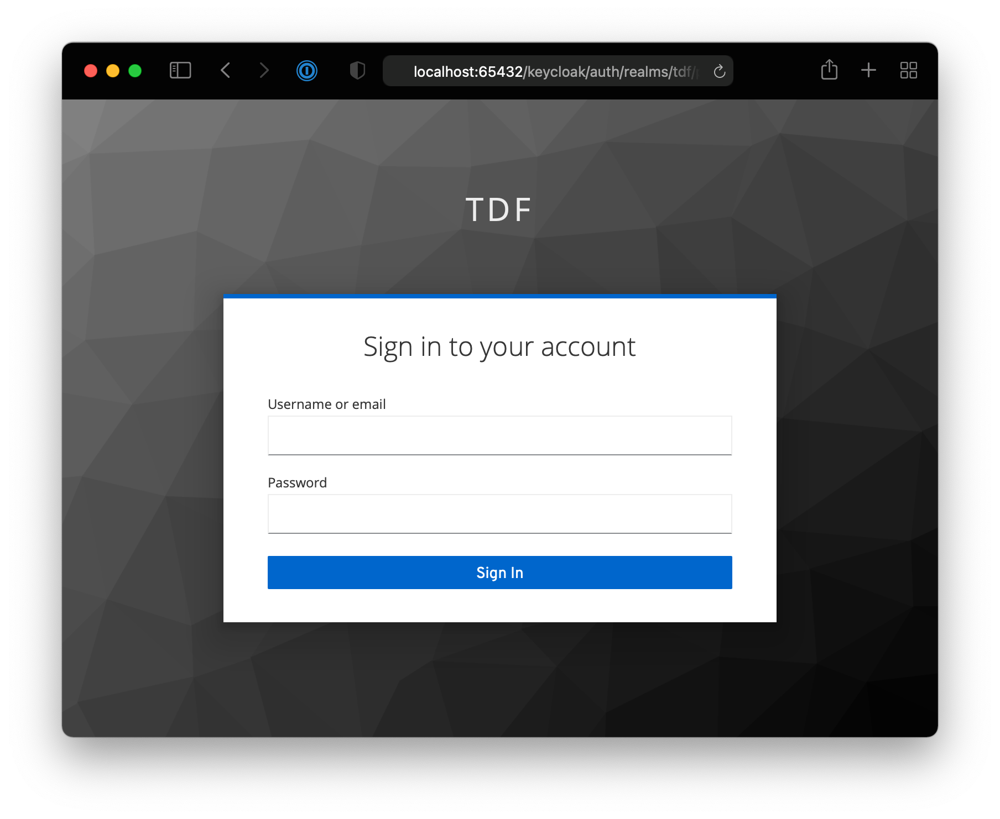
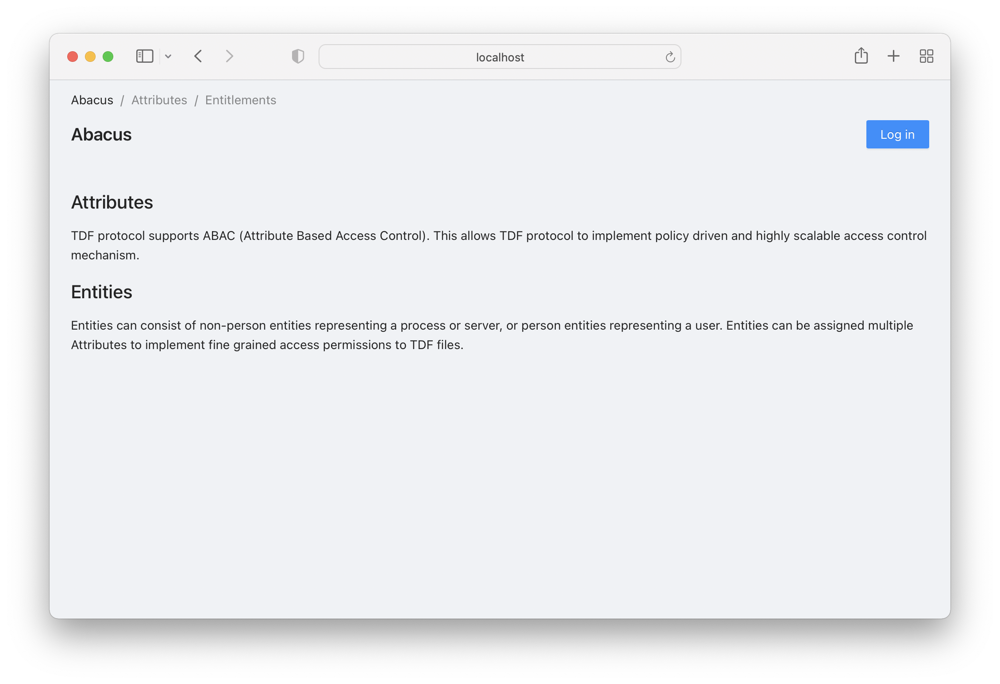
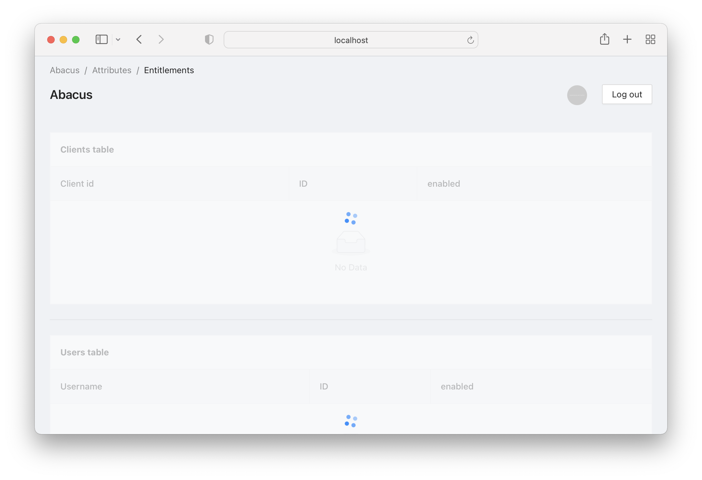
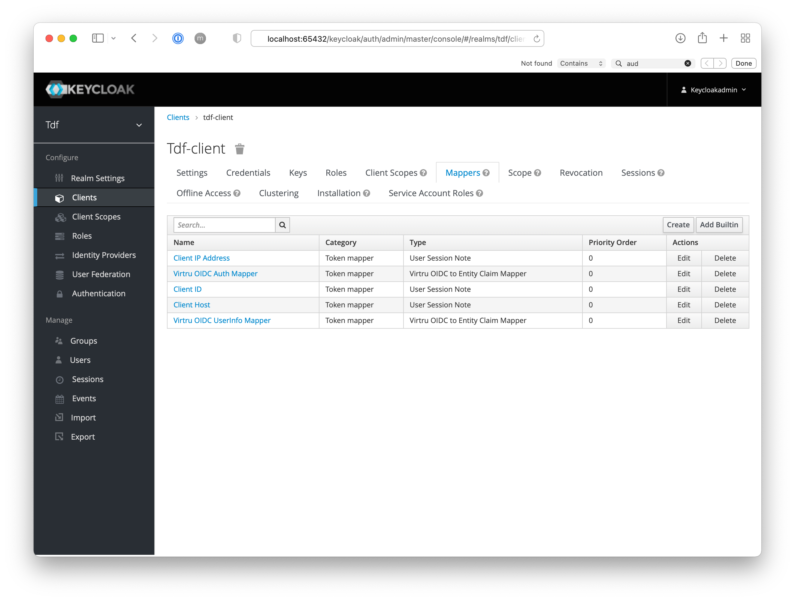
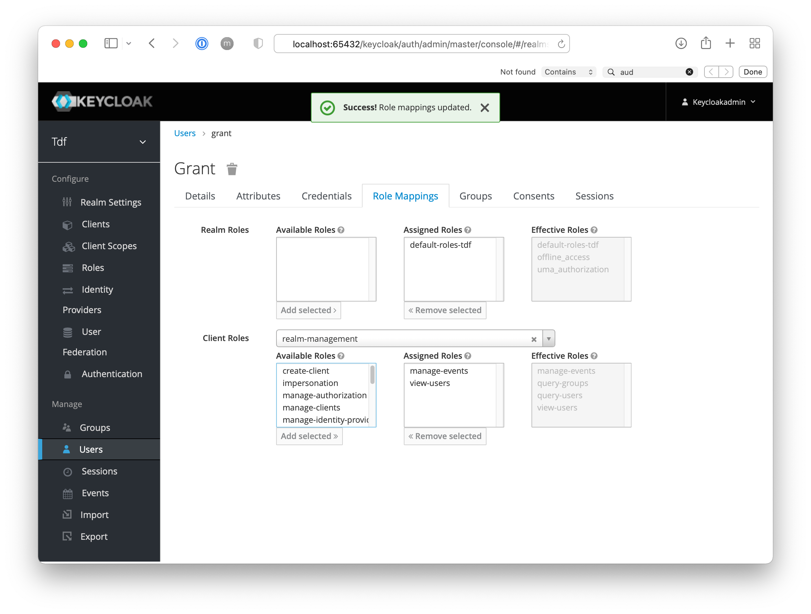

# OpenTDF Quickstart

**_Not for production_**

A quick (less than 10 minutes) and easy process to protect data with TDF using the opentdf stack.

## Getting a Local Backend Up and Running

### Prerequisites

- Install [Docker](https://www.docker.com/)

  - see https://docs.docker.com/get-docker/

- Install [kubectl](https://kubernetes.io/docs/reference/kubectl/overview/)

  - On macOS via Homebrew: `brew install kubectl`
  - On Linux or WSL2 for Windows: `curl -LO "https://dl.k8s.io/release/$(curl -L -s https://dl.k8s.io/release/stable.txt)/bin/linux/amd64/kubectl" && chmod +x kubectl && sudo mv kubectl /usr/local/bin/kubectl`
  - Others see https://kubernetes.io/docs/tasks/tools/

- Install [kind](https://kind.sigs.k8s.io/)

  - On macOS via Homebrew: `brew install kind`
  - On Linux or WSL2 for Windows: `curl -Lo kind https://kind.sigs.k8s.io/dl/v0.11.1/kind-linux-amd64 && chmod +x kind && sudo mv kind /usr/local/bin/kind`
  - Others see https://kind.sigs.k8s.io/docs/user/quick-start/#installation

- Install [helm](https://helm.sh/)

  - On macOS via Homebrew: `brew install helm`
  - On Linux or WSL2 for Windows: `curl -LO https://get.helm.sh/helm-v3.8.2-linux-amd64.tar.gz && tar -zxvf helm-v3.8.2-linux-amd64.tar.gz && chmod +x linux-amd64/helm && sudo mv linux-amd64/helm /usr/local/bin/helm`
  - Others see https://helm.sh/docs/intro/install/

- Install [Tilt](https://tilt.dev/)
  - On macOS via Homebrew: `brew install tilt-dev/tap/tilt`
  - On Linux or WSL2 for Windows: `curl -fsSL https://github.com/tilt-dev/tilt/releases/download/v0.27.2/tilt.0.27.2.linux.x86_64.tar.gz | tar -xzv tilt && sudo mv tilt /usr/local/bin/tilt`
  - Others see https://docs.tilt.dev/install.html

### Pull repository

```shell
git clone https://github.com/opentdf/opentdf.git
cd opentdf/quickstart
```

### Log in to GitHub Container Registry

Follow [these instructions to log in to ghcr.io](https://docs.github.com/en/packages/working-with-a-github-packages-registry/working-with-the-container-registry#authenticating-to-the-container-registry).

### Create cluster

```
kind create cluster --name opentdf
```

### Start services

To initialize a basic OpenTDF cluster
with a Keycloak identity provider,
PostgresQL data store,
and a single entry point at localhost with an nginx ingress controller,
we provide a [Tiltfile](https://tilt.dev/):

```shell
tilt up
```

#### Alternative install

As an alternative, the `start.sh` script can be used to set up a similar cluster.
This bash shell script will use helm to install the required services;
for more options, read the script and review the actions it takes.
Notably, has options to assist with loading an 'offline bundle' generated with
the [`build-offline-bundle`](../examples/offline/build-offline-bundle) script,
and options to disable or skip configuration of various features and services.

The script is run with the following options:
- MONOLOG_LEVEL: Logging level. See documentation [here](https://github.com/opentdf/opentdf/blob/main/scripts/monolog)
- LOCAL_TOOL: Which container orchestration tool helper library to use. Supported options are "kind", "minikube". See [lib-local](https://github.com/opentdf/opentdf/blob/main/scripts/lib-local.sh) for implementation. 
- SERVICE_IMAGE_TAG: The semver OpenTDF version to install 

Example:

```shell
export MONOLOG_LEVEL=0
export LOCAL_TOOL=kind
export SERVICE_IMAGE_TAG=1.1.1
./start.sh
```

Note the following when attempting to use the start.sh script method:
- In-line rewriting of values files may be prone to error, and only works once, so changing the INGRESS_HOSTNAME and re-running won’t change anything. This probably should be a separate script that is run manually before start.sh, and reports errors if it fails. See [Line 245](https://github.com/opentdf/opentdf/blob/main/quickstart/start.sh#L245)
- 3rd party version information hard-coded on [Line 263](https://github.com/opentdf/opentdf/blob/main/quickstart/start.sh#L263)
- some waiter methods may wait indefinitely when they should have a timeout; e.g., [Line 105](https://github.com/opentdf/opentdf/blob/main/quickstart/start.sh#L105)


#### Monitor services

Hit (space) and wait for all resources to turn green.
Or go to http://localhost:10350/

Services should be up in 4-6 minutes.

##### Optional

- Install [Octant](https://octant.dev/)

  - On macOS via Homebrew: `brew install octant`
  - Others see https://docs.vmware.com/en/VMware-vSphere/7.0/vmware-vsphere-with-tanzu/GUID-1AEDB285-C965-473F-8C91-75724200D444.html

- Run the `octant` command in any terminal window to
  open a more detailed services dashboard.

## Running tests with Python client

### Install client library

```shell
pip3 install --upgrade opentdf
```

### Execute tests to encrypt and decrypt. Assume you're in $PROJECT_ROOT/quickstart, run:

```shell
python3 tests/oidc-auth.py
```

See success message

```text
TDF Encrypt/Decrypt is successful!!
Nano TDF Encrypt/Decrypt is successful!!
```

See the TDF files under `$PROJECT_ROOT/quickstart` (the directory from which the `oidc-auth.py` was run)
Report errors to [support@OpenTDF.io](MAILTO:support@OpenTDF.io)

### Clean up

NOTE: Running kind delete will wipe your local cluster and any data associated with it. Delete at your own risk!

```shell
tilt down
kind delete cluster --name opentdf
pip3 uninstall opentdf
```

## Overview


### C++ Client

See [the OpenTDF Client base repo](https://github.com/opentdf/client-cpp) for details about how to configure a C++ application to use OpenTDF.

### Services

#### Attributes

Manage attributes with rules used in ABAC
[OpenAPI](https://github.com/opentdf/backend/blob/main/containers/attributes/openapi.yaml)

<!--http://localhost:65432/api/attributes/docs-->

#### Abacus

The abacus web service provides a visual management interface for entitlements and attribute rules.

To access, we must first add a redirect uri in keycloak. Run `tilt up`, wait for services to start, navigate to `http://localhost:65432/auth`, and click on `Administration Console`.


Log in with the credentials generated by the [values fed into the bootstrap script](helm/values-keycloak-bootstrap.yaml#L45-L46), currently the username is `keycloakadmin` and the password is `mykeycloakpassword`.



Then navigate to `http://localhost:65432/auth/admin/master/console/#/tdf/clients` and click on `opentdf-abacus`.

You will see a field titled `Valid Redirect URIs`. Add `http://localhost:65432/*` as a valid redirect uri by adding it to the field as shown, clicking the `+` button, and scrolling to the bottom of the page and saving the changes.


Now, to view Abacus, navigate to `http://localhost:65432`.



Click `Log In`. Abacus will forward you to the login screen to acquire user credentials.


Log in using the credentials generated with the bootstrap script (supplied via Helm [here](helm/values-keycloak-bootstrap.yaml#L276-L295)), or with the default credentials, which are currently "user1" and the password is "testuser123".


If your credentials are accepted, keycloak will redirect you to the abacus home screen. If your credentials are not accepted, you can log in to keycloak separately with the client credentials and fix the user login information.


From here, you can get a list of attributes or clients.



#### Configuring user permissions with Abacus

Abacus provides a front-end that links a keycloak identity provider with a custom attribute-based access control system.
To log in and use abacus itself, you must create and use _User_ accounts in the _tdf_ realm of the associated keycloak service.

To create an abacus login, open up keyloak, which will be available at [port 65432](http://localhost:65432/auth/).


Log in with the credentials generated by the [values fed into the bootstrap script](helm/values-keycloak-bootstrap.yaml#L45-L46), currently the username is `keycloakadmin` and the password is `mykeycloakpassword`.

The bootstrap script also binds this client to a custom, OpenTDF attribute mapper, which allows the entitlement service to link attributes to given subjects, either clients (NPE subjects that act as services or service providers) or users and services that act on behalf of a single account.



If you want to modify this sample to deploy to another domain, redirect and web origins need too be set under client > tdf-\* > settings


Abacus users are keycloak users that have aud: `tdf-entitlement`. Unique for public access with standard flow, you need this or you will see an error saying ‘audience is not correct’.


In the users panel, to grant a user access to abacus to view and edit attributes, they must be associated with the realm role, `default-tdf-role`. To grant them access to list and view entities, required to assign attributes to a user, you must also grant them the `realm-management` roles `view-events` and `view-users`.



#### entitlements

Manage assignment of attributes to entities
[OpenAPI](https://github.com/opentdf/backend/blob/main/containers/entitlements/openapi.yaml)

<!-- http://localhost:65432/api/entitlements/docs -->

#### entitlement-store

Read-only access to the attributes that have been assigned to an entity in the static database store

#### entitlement-pdp

Generate entitlements on-demand (using OpenPolicyAgent and pluggable Rego policy) for entities.

#### key-access

Access control of the key using ABAC
Swagger http://localhost:65432/api/kas/ui/ (update `/kas/openapi.json`)

## Examples

See [Examples](../examples) for examples of OpenTDF in action.

## Integrate

See [Integrate](../integrate) for instructions on how to integrate opentdf.

## Troubleshooting

See `opentdf/troubleshooting/README.md` for troubleshooting information on Quickstart
